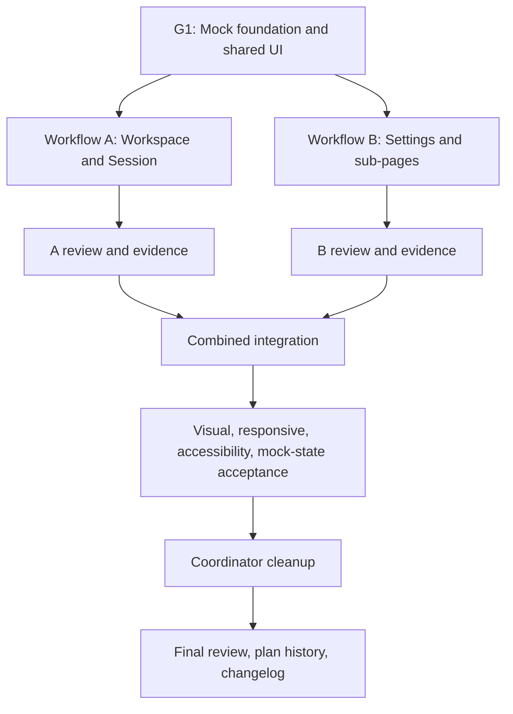

# OpenCrane UI — two-machine mock implementation workflow

## Purpose and scope

This workflow executes `ui_implementation_plan_revised.md` as a UI-only handoff using deterministic
in-browser mocks. It owns sequencing, mock ownership, branches, commits, review gates, integration,
and rollback for two developers working on separate machines.

Backend routes, generated API contracts, CLI commands, OIDC, live Gateway transport, persistence,
deployment, and server authorization are outside this delivery. Mock permission and failure states
exist to exercise the design; they are not security or integration proof.

## Repository workflow rules

- `plan.md` is updated in the same work cycle as status, evidence, or blocker changes.
- The parent UI track moves to `plan-done.md` only after both lanes and combined acceptance pass.
- `CHANGELOG.md` is updated only when the complete parent track ships.
- Every TypeScript slice follows `docs/agents/typescript.md` and runs the style checker.
- Angular work follows `docs/agents/angular.md` except for its backend-first integration rule, which
  the user has explicitly replaced with this mock-only handoff scope.
- Resolve every Critical and High independent-review finding before a gate completes.

## Concurrency model



Both feature lanes start from the exact reviewed `UI_SHARED_READY_SHA` produced by G1.

## Branches

1. The coordinator completes G1 on `codex/ui-handoff-integration` through reviewed commits.
2. Record the immutable passing commit as `UI_SHARED_READY_SHA` in `plan.md`.
3. Create and push:
   - `codex/ui-session`
   - `codex/ui-settings`
4. Each developer checks out only their assigned branch on their own machine.
5. Each lane edits only its manifest paths and opens a PR into `codex/ui-handoff-integration`.
6. Merge the first reviewed lane. The second lane synchronizes the updated integration branch,
   reruns its gate, and then merges.

## Coordinator-owned paths

```text
plan.md
plan-done.md
CHANGELOG.md
package.json
package-lock.json
nx.json
tsconfig*.json
apps/design_handoff/**
apps/opencrane-ui/project.json
apps/opencrane-ui/src/styles.scss
apps/opencrane-ui/public/fonts/**
apps/opencrane-ui/src/app/app.config.ts
apps/opencrane-ui/src/app/app.routes.ts
apps/opencrane-ui/src/app/core/models/**
apps/opencrane-ui/src/app/core/mocks/**
apps/opencrane-ui/src/app/core/state/**
apps/opencrane-ui/src/app/core/theme/**
apps/opencrane-ui/src/app/shared/components/**
apps/opencrane-ui/src/app/features/workspace/workspace.routes.ts
apps/opencrane-ui/src/app/features/settings/settings.routes.ts
apps/opencrane-ui-e2e/project.json
apps/opencrane-ui-e2e/playwright.config.ts
apps/opencrane-ui-e2e/src/support/**
```

The coordinator owns the typed mock provider surface, scenario selection, mock clock/reset behavior,
shared barrels, global theme, shared components, root routes, and test harness. Lanes request changes
to these frozen seams rather than editing them.

## G1 — Mock foundation and shared UI

### G1.1 — Project targets and test harness

Create:

- app-local lint and unit-test targets;
- Playwright `e2e` and `visual` targets with `@axe-core/playwright`;
- deterministic scenario selection and fixture reset;
- desktop, tablet, and mobile projects;
- screenshot actual/diff artifact output;
- a zero-unexplained-diff policy.

There is no `live` target in this mock-only delivery.

### G1.2 — Typed mock provider

Create under `apps/opencrane-ui/src/app/core/`:

```text
models/**
mocks/
├── mock-clock.service.ts
├── mock-scenario.service.ts
├── mock-identity.service.ts
├── mock-access.guard.ts
├── mock-first-run.guard.ts
├── provide-ui-mocks.ts
├── mock-session.service.ts
├── mock-settings.service.ts
├── mock-organization.service.ts
├── mock-budget.service.ts
├── mock-skill.service.ts
├── mock-channel.service.ts
├── mock-data-network.service.ts
├── mock-credential.service.ts
├── fixtures/**
└── testing/**
state/
├── session.facade.ts
└── settings.facade.ts
```

Freeze the public facade and model APIs after tests cover:

- default, empty, loading, error, permission, limits, offline, and long-content modes;
- identity, active tenant, member/admin, no-tenant, and first-run route states;
- mutation pending/success/failure/cancel/reset;
- seeded IDs, time, stream chunks, progress, and latency;
- isolation between tests and route reloads;
- secret-shaped values never entering persistence, URLs, logs, or snapshots.

Add a named mock build/serve configuration that registers `provideUiMocks()`. It overrides the
existing access and first-run guard tokens with deterministic mock implementations and supplies mock
identity/tenant state. The default production configuration does not register these providers, and
the production guard source files remain unchanged.

### G1.3 — Theme and shared components

Implement the semantic tokens, DM Sans/DM Mono, PrimeNG preset, contrast table, focus/reduced-motion
rules, and shared components required by the revised plan. Shared components are presentational and
consume frozen signal inputs/outputs only.

### G1.4 — Route seams

Preserve existing out-of-scope top-level routes. The coordinator creates buildable placeholder route
arrays in `features/workspace/workspace.routes.ts` and `features/settings/settings.routes.ts`, mounted
through a coordinator-owned shared route-placeholder component. At `UI_SHARED_READY_SHA`, ownership
of those two files transfers to Workflow A and Workflow B respectively.

The frozen seam provides:

- Workflow A route array for `/` and `/session/:sessionId`;
- one lazy `/settings` mount owned internally by Workflow B;
- existing `/tools` and `/admin` routes left intact.

The G1 production build validates that production guard providers remain selected; mock E2E/visual
targets use the explicit mock build and validate direct workspace navigation without OIDC.

### G1 validation

```bash
npx nx show project opencrane-ui
npx nx show project opencrane-ui-e2e
npx nx run opencrane-ui:lint
npx nx run opencrane-ui:test
npx nx run opencrane-ui:build:production
npx nx run opencrane-ui-e2e:e2e
npx nx run opencrane-ui-e2e:visual
npm run lint:boundaries
scripts/agent-style-check.sh --diff <G1_BASE_SHA>
```

Run independent review, resolve Critical/High findings, update `plan.md`, and record
`UI_SHARED_READY_SHA`. Only then create the two feature branches.

Suggested commit:

```text
✨ deliver the shared mock UI foundation
```

## Workflow A — Workspace and Session

### Ownership

```text
apps/opencrane-ui/src/app/features/workspace/**
apps/opencrane-ui/src/app/features/session/**
apps/opencrane-ui-e2e/src/session/**
apps/opencrane-ui-e2e/src/visual-baselines/session/**
```

### A1 — Shell and sidebar

- Persistent shell, 192px desktop sidebar, mobile drawer, routes, identity footer.
- New/select/shared sessions and active/unread/activity states through `SessionFacade`.
- Loading, empty, error, long-content, keyboard, and focus-restoration coverage.

### A2 — Header, stream, citations, and tools

- Session header, scope badge, model, Share states.
- User/assistant/tool messages, Markdown, code, stream chunks, A2UI presentation, citations.
- Pending/final/cancelled/retry/offline/reconnected/refusal/terminal mock sequences.

### A3 — Composer and actions

- Growing textarea, Enter/Shift+Enter, whitespace rejection, draft clearing, reader-safe scrolling.
- Attach, Share, copy, cancel, retry, and contract-summary behavior through the mock facade.

### A4 — Lane gate

- Unit, route, interaction, axe, responsive, and visual coverage for all Session mock modes.
- TypeScript style check, boundary check, production build, and independent review.

## Workflow B — Settings and sub-pages

### Ownership

```text
apps/opencrane-ui/src/app/features/settings/**
apps/opencrane-ui-e2e/src/settings/**
apps/opencrane-ui-e2e/src/visual-baselines/settings/**
```

### B1 — Settings shell

- Three-column desktop layout, mobile drawers, nested routes, scope switch, shared form behavior.
- Compose only the frozen `SettingsFacade` and shared components.

### B2 — Workspace Settings

- Pod, Members/organization, Budgets, Skills, Channels, Data & Network, Provider Keys.
- All documented loading, empty, validation, pending, success, permission, limit, and failure states.

### B3 — Personal Settings

- Account, Awareness, My Budget, My API Keys.
- Mock avatar/notification updates, contract preferences, budget states, one-time token reveal/revoke.

### B4 — Routed sub-pages

- Department, Team, Project, Skills Marketplace, Configure/Add Channel, Add Provider Key.
- Back navigation, invalid IDs, Save/Cancel, unsaved changes, destructive confirmation.

### B5 — Lane gate

- Unit, route, form, axe, responsive, and visual coverage for every Settings scenario and sub-page.
- TypeScript style check, boundary check, production build, and independent review.

## Combined integration

After both lanes merge:

1. Run the full app/E2E suite from a clean checkout.
2. Verify browser history, direct links, invalid IDs, drawer/focus behavior, 200% zoom, reduced motion,
   keyboard operation, and screen-reader labels.
3. Capture all approved viewports and mock-state variants.
4. Confirm mock reset and scenario selection are deterministic across the combined app.
5. Remove only superseded frontend paths proven unused by consumer search and replacement tests.
6. Run independent review after cleanup and rerun the full gate.

## Stop conditions

Stop a lane when:

- it edits coordinator or other-lane paths;
- it adds component-local fixture arrays or a second mutable store;
- it bypasses a facade or changes a frozen mock/model API;
- it makes network calls or adds backend/API/CLI/deployment work;
- mock time, IDs, streams, or delays are nondeterministic;
- secret-shaped data enters persistence, URLs, logs, DOM attributes, or snapshots;
- lint, test, build, boundary, style, visual, accessibility, or review gates fail.

The two coordinator-authored route stub files transfer at `UI_SHARED_READY_SHA`; replacing their
placeholder arrays is the only pre-authorized lane edit to a G1-created file.

## Two-machine synchronization audit

Before the second lane synchronizes, record its `PRE_SYNC_TIP` and audit
`UI_SHARED_READY_SHA..PRE_SYNC_TIP`. Merge the updated integration branch, record `SYNC_SHA`, and
audit later lane fixes as `SYNC_SHA..HEAD`. The coordinator integration merge is the sole ownership
exception and is listed separately in evidence; its lane-one paths are not lane-two authorship.

## Completion

The parent UI track completes when both lanes, combined routing, every named mock scenario,
responsive/visual acceptance, WCAG 2.2 AA checks, frontend cleanup, independent review, roadmap
history, and capability-first changelog are complete. Backend integration is a separate future track.
