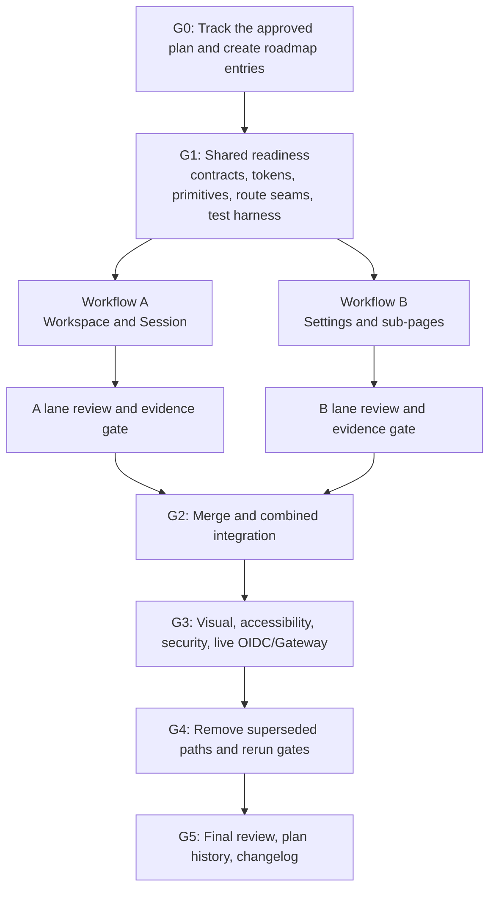

# OpenCrane UI — Concurrent Implementation Workflow

## Purpose

This document defines how to execute `ui_implementation_plan_revised.md` as two concurrent delivery
workflows while following `docs/agents/workflow.md`.

It does not modify or replace the revised implementation plan. The plan remains the source for scope,
architecture, design, TypeScript, responsive, accessibility, security, and acceptance requirements;
this document owns sequencing, file ownership, commits, review gates, integration, and rollback.

## Workflow rules inherited from `docs/agents/workflow.md`

- `plan.md` is the live backlog and must be updated in the same work cycle whenever a wave changes
  status or discovers a blocker.
- A fully completed track moves to `plan-done.md`; `plan.md` retains a one-line
  `✅ COMPLETE (see plan-done.md)` pointer.
- A completed track updates `CHANGELOG.md` in the same cycle with capability-first wording.
- Every work cycle ends with a suggested emoji-leading, imperative commit subject under 72 characters.
- Run `scripts/agent-style-check.sh` before independent review whenever TypeScript changes.
- The TypeScript self-review table is required but does not replace independent review.
- Resolve every Critical and High review finding before a wave or integration gate completes.
- Use the `review` agent for a small slice and `review-loop` for multi-file or risky slices.

## Current preflight condition

`apps/design_handoff/` is currently untracked. A second worktree created now would not contain the
revised plan or this workflow.

Before implementation begins, the coordinator must obtain approval for the handoff artifacts, commit
the intended source-of-truth files on a `codex/` integration branch, and record that commit. Do not
launch the concurrent worktrees from untracked local files.

## Concurrency model

There are two implementation workflows:

- **Workflow A — Workspace and Session:** persistent shell, primary sidebar, session routes, live
  conversation presentation, citations, composer, contract summary, and Session acceptance.
- **Workflow B — Settings:** Settings shell and navigation, Workspace and Personal sections, routed
  management sub-pages, forms, credentials, and Settings acceptance.

They run concurrently only after a shared coordinator-owned readiness gate.



G0 and G1 are hard predecessors, not a third feature workflow. Both lanes start from the exact same
reviewed G1 commit.

## Coordinator and branch model

### Branches and worktrees

1. Create `codex/ui-handoff-integration` from the approved tracked handoff commit.
2. Complete G0 and G1 on that branch.
3. Record the immutable readiness commit as `UI_SHARED_READY_SHA` in `plan.md`.
4. Create sibling worktrees from that exact SHA:
   - `codex/ui-session`
   - `codex/ui-settings`
5. Each lane commits only files assigned to it by the ownership manifest.
6. Merge reviewed lanes into `codex/ui-handoff-integration` with non-fast-forward merges so lane
   history and review boundaries remain visible.
7. Merge the first completed lane. Before merging the second, merge the updated integration branch
   into that lane and rerun its gate against the combined public seams.
8. Do not squash or cherry-pick overlapping partial waves before combined verification.

### Single-writer files

Only the coordinator edits these files during parallel execution:

```text
plan.md
plan-done.md
CHANGELOG.md
package.json
package-lock.json
nx.json
tsconfig*.json
apps/opencrane-ui/project.json
apps/opencrane-ui/src/styles.scss
apps/opencrane-ui/public/fonts/**
apps/opencrane-ui/src/app/app.config.ts
apps/opencrane-ui/src/app/app.routes.ts
apps/opencrane-ui/src/app/core/theme/**
apps/opencrane-ui/src/app/shared/components/**
apps/opencrane-ui-e2e/project.json
apps/opencrane-ui-e2e/playwright.config.ts
apps/opencrane-ui-e2e/src/support/**
libs/frontend/core/**
libs/frontend/elements/ui/**
libs/frontend/features/tools/**
libs/frontend/state/gateways/**
libs/frontend/state/mcp/**
libs/frontend/state/tenant/**
libs/contracts/**
```

The coordinator owns shared barrels, generated contracts, provider registration, global tokens,
shared component APIs, and route composition. A lane needing one of these changes submits a minimal
change request instead of editing the file.

### Ownership manifest

G1 creates a checked ownership manifest. Each entry records:

- path glob;
- owner: coordinator, Workflow A, or Workflow B;
- public exports and consumers;
- API/state owner;
- migration source;
- deletion owner;
- planned completion wave.

Before every lane commit, compare the changed paths to the manifest. An overlap is a stop condition,
not a merge conflict to postpone.

Ownership checks apply to lane-authored commits, not to a coordinator-approved merge that synchronizes
the integration branch into a lane. Before synchronization, record the lane tip SHA and audit
`<UI_SHARED_READY_SHA>..<LANE_TIP_SHA>`. Record the synchronization merge SHA; any subsequent lane
fixes are audited over `<SYNC_MERGE_SHA>..HEAD`. The evidence bundle lists the lane-authored range and
the exempt coordinator merge separately.

## Shared gates

### G0 — Approved source and active-roadmap setup

The coordinator:

1. Tracks the approved revised plan, this workflow, and required handoff references.
2. Adds one parent UI handoff track to `plan.md` with:
   - Shared Readiness;
   - Workflow A — Workspace and Session;
   - Workflow B — Settings;
   - Combined Integration and Cleanup.
3. Records owner, branch, allowed paths, dependencies, status, evidence location, and blocker field for
   every item.
4. Creates the route-to-capability matrix and migration inventory required by Track 0 of the revised
   plan.
5. Confirms API/generated-type/CLI parity, roles, and data ownership for every enabled mutation.

Stop G0 if a visible mutation has no supported contract, authorization is unknown, or a fixture-only
action would appear functional. Unsupported controls remain disabled/read-only or leave the release
scope explicitly.

For repository-state purposes, the parent UI handoff is the only roadmap **track**. G0–G4, A1–A4,
and B1–B5 are waves/sub-items, even where the revised implementation plan calls them tracks. A wave
passing does not trigger `plan-done.md` or `CHANGELOG.md`; the parent track completes only at G5 after
both lanes, integration, live acceptance, and cleanup pass. This avoids declaring a foundation or
single lane shipped before the combined capability is complete.

Suggested commits:

```text
🏡 track the OpenCrane UI handoff workflow
🏡 define UI contract and migration ownership
```

### G1 — Shared readiness

The coordinator completes the plan's foundation before forking lanes:

- app-local lint/test targets;
- Playwright/axe `e2e`, `visual`, and `live` targets;
- accessible semantic tokens, fonts, PrimeNG preset, contrast table, focus and motion rules;
- tested shared components and frozen signal input/output APIs;
- persistent workspace outlet and one lazy `/settings` mount;
- route ownership seam: Workflow A owns Workspace/Session routes; Workflow B owns nested Settings
  routes;
- baseline bundle/style sizes;
- ownership manifest and deletion list;
- empty smoke pass for app and E2E targets.

Validation:

```bash
npx nx show project opencrane-ui
npx nx show project opencrane-ui-e2e
npx nx run opencrane-ui:lint
npx nx run opencrane-ui:test
npx nx run opencrane-ui:build:production
npx nx run opencrane-ui-e2e:e2e
npx nx run opencrane-ui-e2e:visual
npm run lint:boundaries
scripts/agent-style-check.sh --diff <G0_SHA>
```

Run `review-loop` because the foundation crosses configuration, routing, shared components, and test
infrastructure. Resolve all Critical/High findings and rerun the gate.

The coordinator then updates `plan.md`, records `UI_SHARED_READY_SHA`, marks both workflows unblocked,
and commits:

```text
✨ deliver the shared accessible UI foundation
```

Do not start either lane before this commit exists and passes review.

## Workflow A — Workspace and Session

### Exclusive ownership

```text
apps/opencrane-ui/src/app/core/api/session-api.service.ts
apps/opencrane-ui/src/app/core/models/session.types.ts
apps/opencrane-ui/src/app/core/models/citation.types.ts
apps/opencrane-ui/src/app/core/state/session.facade.ts
apps/opencrane-ui/src/app/features/workspace/**
apps/opencrane-ui/src/app/features/session/**
apps/opencrane-ui-e2e/src/session/**
apps/opencrane-ui-e2e/src/visual-baselines/session/**
libs/frontend/features/workspace/**
libs/frontend/features/conversation/**
libs/frontend/features/context/**
libs/frontend/state/conversation/**
```

Workflow A treats coordinator-owned shared components and configuration as read-only.

### A1 — Workspace shell and sidebar

- Migrate the persistent shell without duplicating session state.
- Wire `/` and `/session/:sessionId` through Workflow A's route array.
- Connect the frozen app sidebar to identity/session facades.
- Preserve new-session relay, owned/shared lists, active/unread/activity state, and identity footer.
- Add loading, empty, error, responsive drawer, keyboard, and focus-restoration behavior.
- Keep existing workspace exports until parity is proven.

Required evidence:

- route/deep-link/invalid-ID/history tests;
- 192px desktop and mobile drawer visual results;
- focused app plus existing workspace-library tests while it remains an owner;
- boundary and TypeScript style checks;
- independent review with all Critical/High findings resolved.

Commit:

```text
🚚 migrate the workspace shell and sidebar
```

### A2 — Session header, message stream, citations, and tools

- Add the Session facade over the existing gateway; do not create another message store.
- Migrate/restyle the header, Markdown, stream blocks, tool groups, A2UI, and message roles.
- Render citation strips for every type/scope/status combination.
- Preserve history loading, reconnect, refusal, retry, cancellation, and terminal failure.
- Implement Share states; unsupported sharing remains disabled with explanation.

Required evidence:

- conversation/render/context unit and integration tests;
- all message, citation, tool, A2UI, empty, history, streaming, and failure variants;
- 924x540 reference comparison and all responsive Session widths;
- style, boundary, security, accessibility, and independent review results.

Commit:

```text
🎨 restyle the live session stream and citations
```

### A3 — Composer, scrolling, and live behavior

- Implement the growing composer and awareness-contract summary.
- Preserve gateway send and new-session creation.
- Enter sends; Shift+Enter creates a newline; whitespace does not send.
- Clear drafts only after accepted sends.
- Preserve reader position and use near-bottom/current-user scrolling rules.
- Cover connecting, disconnected, reconnecting, abort, retry, and terminal states.
- Keep Attach disabled until upload contracts and failure/cancel states exist.

Required evidence:

- composer, cache, adapter, scrolling, and failure tests;
- Session visual/accessibility suite at all five viewports;
- live OIDC/Gateway test for history, send, stream, tools/A2UI, cancel, transport-loss reconnect,
  refusal, and terminal error;
- style, boundaries, bundle budgets, and independent review.

Commit:

```text
⚡ complete safe live session interactions
```

### A4 — Lane closure

- Finish responsive, keyboard, screen-reader, reduced-motion, zoom/reflow, and touch verification.
- Prove app-local parity and report, but do not perform coordinator-owned cross-cutting cleanup.
- Produce the lane evidence bundle and full TypeScript compliance table.
- Run `review-loop` over the complete Workflow A diff.

Full lane gate:

```bash
npx nx run opencrane-ui:lint
npx nx run opencrane-ui:test
npx nx run opencrane-ui:build:production
npx nx run opencrane-ui-e2e:e2e --grep session
npx nx run opencrane-ui-e2e:visual --grep session
npx nx run opencrane-ui-e2e:live --grep session
npm run lint:boundaries
scripts/agent-style-check.sh --diff <UI_SHARED_READY_SHA>
```

Add all still-owning conversation/workspace/context/state projects to the lane gate. Workflow A is
mergeable only with zero unexplained visual diffs, zero unresolved WCAG A/AA violations, and no
unresolved Critical/High findings.

Commit:

```text
🧪 close Session acceptance gates
```

## Workflow B — Settings

### Exclusive ownership

```text
apps/opencrane-ui/src/app/core/api/settings-api.service.ts
apps/opencrane-ui/src/app/core/api/members-api.service.ts
apps/opencrane-ui/src/app/core/api/budgets-api.service.ts
apps/opencrane-ui/src/app/core/api/skills-api.service.ts
apps/opencrane-ui/src/app/core/api/channels-api.service.ts
apps/opencrane-ui/src/app/core/api/data-network-api.service.ts
apps/opencrane-ui/src/app/core/api/credentials-api.service.ts
apps/opencrane-ui/src/app/core/models/settings.types.ts
apps/opencrane-ui/src/app/core/models/organization.types.ts
apps/opencrane-ui/src/app/core/models/budget.types.ts
apps/opencrane-ui/src/app/core/models/skill.types.ts
apps/opencrane-ui/src/app/core/models/channel.types.ts
apps/opencrane-ui/src/app/core/state/settings.facade.ts
apps/opencrane-ui/src/app/features/settings/**
apps/opencrane-ui-e2e/src/settings/**
apps/opencrane-ui-e2e/src/visual-baselines/settings/**
libs/frontend/features/settings/**
libs/frontend/state/settings/**
libs/frontend/state/provider-key/**
```

Workflow B treats root routing, shared components, global theme, and existing shared gateways as
read-only. It also treats `libs/frontend/features/tools/**`, `libs/frontend/state/mcp/**`, and
`libs/frontend/state/tenant/**` as coordinator-owned/read-only because they serve existing `/tools`
and `/admin` surfaces. Track 0 may assign a narrower subpath to Workflow B only after the consumer
inventory proves it is Settings-only and adds the affected `/tools` and `/admin` regression gates.

### B1 — Routed Settings shell and data boundary

- Build the three-column shell, 200px Settings nav, Workspace/Personal switch, footer badge, and
  responsive drawers.
- Own all nested Settings routes beneath the coordinator's frozen `/settings` mount.
- Implement dedicated core API services and a Settings facade using generated contracts/resources.
- Implement loading, empty, stale, forbidden, error, dirty, pending, conflict, cancel, and unsaved
  navigation patterns.
- Keep unsupported mutations disabled/read-only.

Required evidence:

- every Settings deep link, redirect, invalid ID, refresh, and browser-history test;
- API/facade coverage for success, validation, 401/403/404/409/429/5xx, timeout/offline;
- keyboard, focus, responsive, visual, style, boundary, and independent review results.

Commit:

```text
✨ add routed Settings shell and state boundary
```

### B2 — Workspace Settings sections

Deliver these disjoint feature groups after B1 freezes facade/service APIs:

- Pod and Members;
- Budgets and Skills;
- Channels, Data & Network, and AI Provider Keys.

The groups may execute concurrently inside Workflow B only when they edit separate feature
directories and do not change routes, shared components, core models, services, or the facade. A
contract change returns to a serialized B1 follow-up.

Required evidence:

- exact README geometry and every documented state;
- member capacity and budget threshold cases;
- connected/disconnected/invalid channel and provider cases;
- write-only credential and no-secret-leakage tests;
- component/resource/form/authorization tests;
- all Settings Workspace baselines and accessibility checks;
- combined B2 review after subgroups merge.

Commit:

```text
✨ add Workspace Settings sections
```

### B3 — Personal Settings sections

- Account with contract-gated avatar and notification controls.
- Awareness fallback, citation mode, scope order, and save states.
- Personal budget zero/normal/warning/exceeded/unavailable states.
- Personal access-token empty/create/reveal/copy/acknowledge/revoke lifecycle, separate from provider
  credentials.

B3 may run beside B2 after B1 because it owns disjoint directories and frozen API methods.

Required evidence:

- resource/form/role/state coverage;
- one-time-token tests proving no secret enters storage, logs, URLs, DOM attributes, snapshots, or
  reusable fixtures;
- deep links, reset behavior, responsive baselines, accessibility, boundaries, style, and review.

Commit:

```text
✨ add Personal Settings sections
```

### B4 — Routed Settings management flows

Begin only after the relevant B2 parent contracts are stable:

- Edit Department, Team, and Project;
- Skills Marketplace;
- Configure and Add Channel;
- Add Provider Key.

Subgroups may run concurrently by directory. All flows include routed back navigation, validation,
dirty-state protection, pending/success/error/conflict, destructive confirmation, and focus
restoration.

Required evidence:

- route parameter/invalid-ID/back-forward tests;
- retained dirty values and navigation confirmation;
- install rollback and connection-test progress/failure;
- destructive-action recovery and focus;
- write-only secret non-retention;
- sub-page responsive/visual/accessibility suite;
- combined B4 review.

Commit:

```text
✨ add routed Settings management flows
```

### B5 — Lane closure

- Run every Settings section/sub-page through the full UX state matrix.
- Complete all five viewports, zoom/reflow, reduced-motion, touch, keyboard, and screen-reader checks.
- Prove app-local parity and report proposed legacy deletions; do not delete shared paths.
- Produce the lane evidence bundle and TypeScript compliance table.
- Run `review-loop` over the complete Workflow B diff.

Full lane gate:

```bash
npx nx run opencrane-ui:lint
npx nx run opencrane-ui:test
npx nx run opencrane-ui:build:production
npx nx run opencrane-ui-e2e:e2e --grep settings
npx nx run opencrane-ui-e2e:visual --grep settings
npm run lint:boundaries
scripts/agent-style-check.sh --diff <UI_SHARED_READY_SHA>
```

Add every still-owning Settings/tools/adapter project to the gate. Workflow B is mergeable only with
zero unexplained Settings diffs, zero unresolved WCAG A/AA violations, no secret leakage, and no
unresolved Critical/High findings.

Commit:

```text
🧪 close Settings acceptance gates
```

## Lane evidence and progress protocol

After every wave, the lane sends the coordinator a structured status payload:

```text
Workflow / wave:
Status: pending | in progress | blocked | complete
Commit SHA:
Owned paths changed:
Contracts/APIs used:
Tests and commands:
Visual/a11y evidence:
TypeScript compliance table:
Independent-review result:
Migration/deletion status:
Blockers or shared-change requests:
Suggested commit message:
```

The coordinator updates `plan.md` in that same work cycle. Lanes never edit `plan.md`,
`plan-done.md`, or `CHANGELOG.md` from their worktrees.

## Integration and completion gates

### G2 — Merge and combined integration

1. Verify both lane evidence bundles and ownership-manifest compliance.
2. Merge the first reviewed lane.
3. Record the second lane tip SHA, audit its lane-authored range, and merge integration into it using
   a coordinator-approved synchronization merge. Record the sync merge SHA, exempt only that merge
   from path ownership, rerun the lane gate, audit any post-sync lane fixes from the sync SHA, then
   merge the lane.
4. Complete coordinator-owned route composition, shared barrels/provider registration, and only the
   minimal shared fixes required by integration.
5. Reject duplicate stores, types, tokens, components, routes, or compatibility branches.

If a semantic conflict occurs, return it to the path owner. The coordinator does not invent a
behavioral resolution in unfamiliar feature code.

### G3 — Combined acceptance

Run:

```bash
npm run build:opencrane-ui
npx nx run opencrane-ui:build:production
npx nx run opencrane-ui:lint
npx nx run opencrane-ui:test
npx nx run opencrane-ui-e2e:e2e
npx nx run opencrane-ui-e2e:visual
npx nx run opencrane-ui-e2e:live
npm run lint:boundaries
scripts/agent-style-check.sh --diff <G1_SHA>
npx nx affected -t test build lint --base=<G1_SHA>
```

Also require:

- combined root/session/settings routing, guards, refresh, history, and lazy loading;
- `/tools` and `/admin` routing, authorization, and package tests whenever a shared tools, MCP,
  provider, tenant, gateway, or route dependency changed;
- all five visual viewports with zero unexplained diffs;
- zero unresolved confirmed WCAG 2.2 A/AA violations plus manual keyboard/screen-reader evidence;
- member/admin authorization, API/CLI parity, secret non-persistence, and destructive-action checks;
- real OIDC/Gateway history/send/stream/tool/A2UI/cancel/reconnect/refusal tests;
- production bundle and component-style budgets.

Run independent `review-loop` over the combined diff and resolve every Critical/High finding.

### G4 — Migration cleanup

Only after G3 passes:

1. Delete paths named in the approved migration deletion list when repository search proves no
   consumer remains.
2. Preserve gateway/render/cache/state behavior still serving the app even if its former view moved.
3. Remove obsolete aliases, barrels, targets, and compatibility branches only with consumer evidence.
4. Keep cleanup in separately revertible commits.
5. Rerun the full G3 gate and independent review after deletion.

Suggested commit:

```text
🔥 remove superseded frontend UI paths
```

### G5 — Planning history and changelog

After both lanes, combined acceptance, and cleanup complete:

1. Move completed track details from `plan.md` to `plan-done.md`.
2. Leave the required one-line completion pointer in `plan.md`.
3. Invoke the `changelog` agent/skill and add a functional `## [Unreleased]` entry describing what
   members and organization admins can now do.
4. Record validation, review, live E2E, visual, accessibility, and migration evidence.
5. Commit the synchronized documentation in the same cycle.

Suggested commit:

```text
📝 record the completed OpenCrane UI handoff
```

## Stop conditions

Stop the affected lane immediately when:

- a mutation lacks API/generated-type/CLI parity;
- data ownership or authorization is unknown;
- the lane changes another owner's path;
- a frozen shared seam must change;
- live gateway behavior is replaced by fixtures/local message state;
- a secret enters storage, logs, URLs, snapshots, DOM attributes, or fixtures;
- the visual baseline authority is ambiguous;
- a required command or gate fails;
- Critical/High review findings remain unresolved;
- the lane base diverges from a changed foundation;
- unrelated dirty work overlaps the owned paths.

The lane reports the blocker. The coordinator updates `plan.md` in the same work cycle and decides
whether to issue a shared patch, narrow scope, or resume from a new readiness SHA.

## Rollback policy

- Keep G1, each lane merge, integration fixes, and cleanup as independently revertible commits.
- If a lane merge breaks integration, revert that merge on the integration branch and preserve the
  lane branch/worktree for repair. Do not reset shared history.
- If the immutable G1 foundation is defective, stop both lanes and repair forward on the integration
  branch. Review the repair, publish a replacement readiness SHA in `plan.md`, merge that repair into
  both lanes, and rerun their gates. Revert propagation is allowed only for a post-G1 shared patch
  whose removal leaves the recorded G1 contract intact.
- Do not delete legacy paths before G3 passes.
- If cleanup fails, revert only the cleanup commit; retain the validated implementation while removal
  is repaired.
- Every rollback updates `plan.md` in the same cycle. A rolled-back capability cannot move to
  `plan-done.md` or appear as shipped in `CHANGELOG.md`.

## Overall definition of done

The concurrent workflow is complete only when both lanes are merged, combined routing and live
behavior pass, visual/accessibility/security gates pass, cleanup passes a second full review, roadmap
state is synchronized, and the changelog describes the delivered user capability rather than the
underlying commits.
