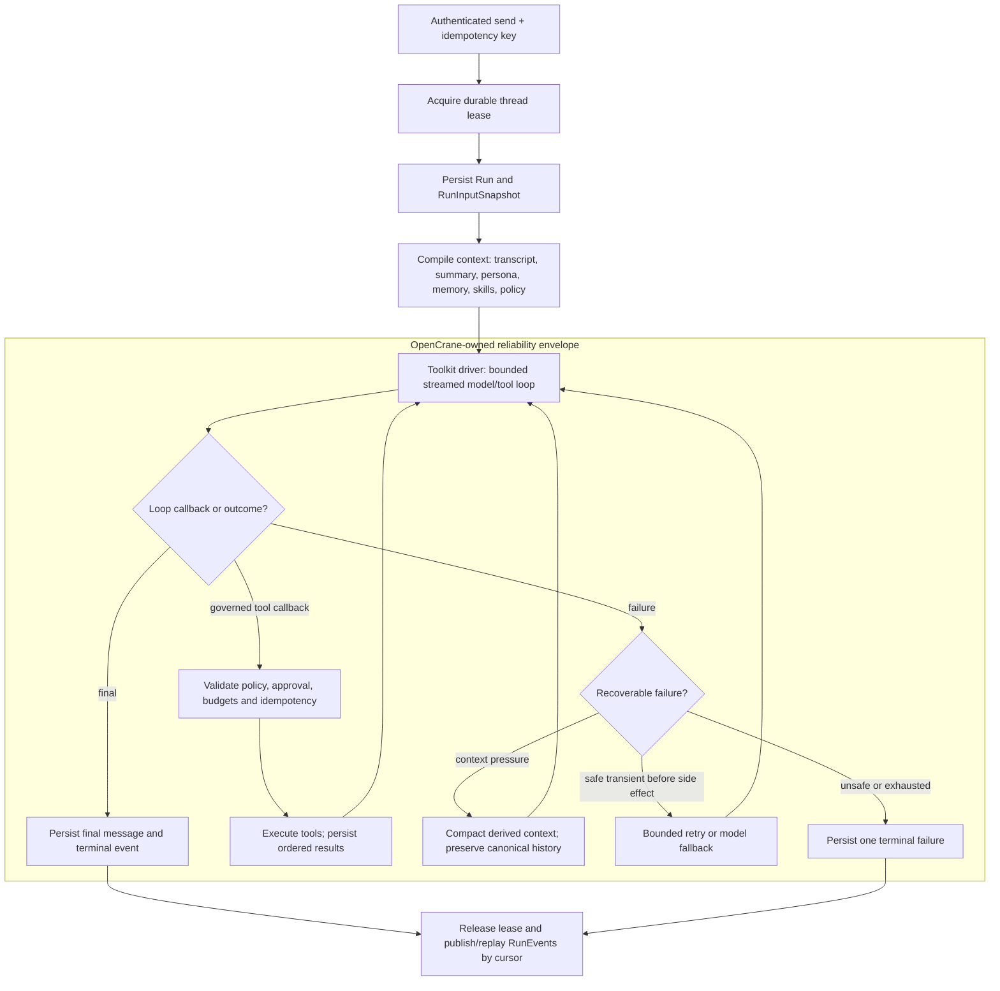

# OpenClaw agent-loop investigation and replacement plan

Status: **proposed for architecture review — 2026-07-16.** This document is an implementation-level
investigation of the OpenClaw runtime pinned by this repository and a gated plan for replacing its
agentic behavior with a smaller toolkit-backed OpenCrane runtime.

It refines the runtime choice in the
[personal-agent platform architecture](personal-agent-platform-architecture.md) and the W6/W7
ordering in the
[personal-agent platform simplification plan](personal-agent-platform-simplification-plan.md). The
same loop baseline and toolkit gate apply to R1/R4 of the alternative
[rewrite-freeze plan](personal-agent-platform-rewrite-freeze-plan.md). This document does not by
itself accept the wider platform redesign or resequence the live GitHub backlog.

## Executive conclusion

OpenClaw does not have one indivisible "agentic loop." It has three layers:

1. a small model/tool loop in the private `@openclaw/agent-core` package;
2. a much larger attempt and recovery envelope that builds context, serializes a session, compacts,
   retries, changes models, and tears down safely;
3. a product runtime around that envelope: Gateway v4, session routing, JSONL transcripts, live
   events, plugin hooks, workspace/persona loading, channel delivery, and runtime configuration.

The small loop is conventional: stream a model response, execute its tool calls, append tool
results, and call the model again until there are no tool calls or queued messages. The behavior
users experience as "OpenClaw" comes mostly from layers 2 and 3. Replacing only the inner loop would
therefore create a demo, not a production replacement.

The recommended direction is:

- make OpenCrane the canonical owner of `Thread`, `Message`, `Run`, ordered `RunEvent`, approval,
  usage, transcript context, compaction, retry, budget, identity, memory, and tool policy;
- use a toolkit only as the bounded model-to-tool-turn engine;
- spike the **TypeScript OpenAI Agents SDK** first and Vercel AI SDK's `ToolLoopAgent` against the
  same black-box conformance suite;
- choose the OpenAI Agents SDK if its LiteLLM path, resumable approvals, cancellation, and event
  semantics pass; choose AI SDK if its thinner, provider-neutral loop proves materially safer;
- build a minimal custom loop only if both toolkits fail a hard gate;
- migrate behind the existing frontend `ConversationGateway`, but introduce an OpenCrane-owned
  backend run/event protocol rather than reproducing Gateway v4;
- prove behavioral parity before switching a tenant, then delete the OpenClaw installer, config,
  protocol, workspace, plugin, and transcript compatibility surface.

This investigation establishes the evidence for a **TypeScript** default and refines the wider
architecture around a conformance-selected loop driver. Python remains appropriate for isolated
user-authored tool Jobs; it is not a reason to add a second implementation language to the
conversational runtime.

## Investigation baseline

The evidence below is pinned to the exact upstream runtime selected by this repository:

- OpenClaw tag: `v2026.6.11`
- upstream commit: `e085fa1a3ffd32d0ea6917e1e6fb4ecbffbb77d2`
- local pins: the [runtime entrypoint](../../apps/feat-openclaw-tenant/deploy/entrypoint.sh),
  [OpenCrane config](../../apps/opencrane/src/app/config.ts), and
  [infra values](../../apps/opencrane-infra/values.yaml)

Current OpenClaw `main` may differ. Parity and migration fixtures must target the deployed pinned
artifact first; any later upgrade is a separate decision.

## How a web-chat turn really runs

### End-to-end call path

For the OpenCrane web UI, the concrete path is:

1. [`OpenClawConversationGateway.send()`](../../libs/frontend/state/conversation/adapter/src/lib/openclaw-conversation-gateway.ts)
   sends Gateway v4 `chat.send` with a session key and idempotency key.
2. The trusted [gateway proxy](../../apps/opencrane/src/gateways/gateway-proxy/proxy.ts) validates the
   browser origin, delegates identity and tenant resolution to the control plane, strips a forged
   identity header, injects the verified user, and forwards the WebSocket to the user's pod.
3. OpenClaw's
   [`chat.send` handler](https://github.com/openclaw/openclaw/blob/e085fa1a3ffd32d0ea6917e1e6fb4ecbffbb77d2/src/gateway/server-methods/chat.ts#L3132-L3330)
   validates and sanitizes the request, resolves the session and agent, and uses the client
   idempotency key as the run id. It then performs
   [run admission, abort registration, attachment staging and early acknowledgement](https://github.com/openclaw/openclaw/blob/e085fa1a3ffd32d0ea6917e1e6fb4ecbffbb77d2/src/gateway/server-methods/chat.ts#L3382-L3612)
   before the
   [asynchronous inbound dispatch](https://github.com/openclaw/openclaw/blob/e085fa1a3ffd32d0ea6917e1e6fb4ecbffbb77d2/src/gateway/server-methods/chat.ts#L3620-L3998).
4. The auto-reply pipeline resolves commands, directives, hooks, queue behavior, and delivery, then
   reaches `runReplyAgent` and
   [`runAgentTurnWithFallback`](https://github.com/openclaw/openclaw/blob/e085fa1a3ffd32d0ea6917e1e6fb4ecbffbb77d2/src/auto-reply/reply/agent-runner-execution.ts#L1564-L1775).
5. `runAgentTurnWithFallback` calls
   [`runEmbeddedAgent`](https://github.com/openclaw/openclaw/blob/e085fa1a3ffd32d0ea6917e1e6fb4ecbffbb77d2/src/agents/embedded-agent-runner/run.ts#L602-L647).
   CLI/operator `agent` requests take another ingress path, but converge on the same embedded
   runner through `runAgentAttempt`.
6. The runner resolves a
   [per-session lane and a global lane](https://github.com/openclaw/openclaw/blob/e085fa1a3ffd32d0ea6917e1e6fb4ecbffbb77d2/src/agents/embedded-agent-runner/run.ts#L622-L772),
   selects the built-in
   [`openclaw` harness](https://github.com/openclaw/openclaw/blob/e085fa1a3ffd32d0ea6917e1e6fb4ecbffbb77d2/src/agents/embedded-agent-runner/run.ts#L1043-L1062),
   then executes attempts under timeout, cancellation, compaction, and fallback controls.
7. The attempt layer obtains the
   [transcript ownership and write lock](https://github.com/openclaw/openclaw/blob/e085fa1a3ffd32d0ea6917e1e6fb4ecbffbb77d2/src/agents/embedded-agent-runner/run/attempt.ts#L2097-L2257),
   opens the session, builds workspace, persona, skills, tools, policy and model context, subscribes
   to events, and
   [calls `session.prompt()`](https://github.com/openclaw/openclaw/blob/e085fa1a3ffd32d0ea6917e1e6fb4ecbffbb77d2/src/agents/embedded-agent-runner/run/attempt.ts#L3403-L3428).
8. The harness invokes the small `@openclaw/agent-core` loop, persists completed messages, and
   emits normalized internal lifecycle events.
9. The outer runner classifies the outcome. It may compact and retry, trim tool results, rotate an
   auth profile or model, or replay the complete primary-to-fallback chain once after a classified
   transient HTTP failure. That last retry is described as "before reply" upstream but is not gated
   by the runner's potential-side-effect state in the
   [transient retry path](https://github.com/openclaw/openclaw/blob/e085fa1a3ffd32d0ea6917e1e6fb4ecbffbb77d2/src/auto-reply/reply/agent-runner-execution.ts#L3206-L3218);
   the replacement must make that retry safer rather than preserve it blindly.
10. Gateway delivery folds cumulative assistant snapshots and tool/session events back into `chat`
    events. The frontend adapter folds those into `ThreadMessage` objects and later reconstructs
    history from a growing tail fetch.

OpenClaw's public "agent loop" description is directionally correct, but the source path above is
the operational definition that matters for replacement.

### The actual inner loop

The private core implementation is compact. Its
[`runLoop`](https://github.com/openclaw/openclaw/blob/e085fa1a3ffd32d0ea6917e1e6fb4ecbffbb77d2/packages/agent-core/src/agent-loop.ts#L258-L432)
does this:

```text
append queued steering messages
stream one assistant response
if response is error/aborted: finish
collect every tool call
execute the batch sequentially when required, otherwise in parallel
append tool results in the assistant's original call order
rebuild context/model state for the next turn
repeat while tools or steering messages remain
drain queued follow-up messages
finish when no tools and no queued messages remain
```

Important details are easy to miss:

- Assistant text, reasoning, and tool-call fragments are emitted as start/update/end lifecycle
  events while the provider stream is consumed.
- A tool can force sequential execution; otherwise calls run concurrently, but result messages are
  appended in original call order.
- Unknown tools, malformed arguments, policy blocks, aborts, and execution exceptions become
  model-visible error tool results instead of crashing the loop.
- `beforeToolCall` can block; `afterToolCall` can rewrite a result or mark it terminating. The batch
  terminates only when every executed result requests termination.
- Steering messages enter before the next model call. Follow-ups can restart the outer loop after a
  turn would naturally finish.
- Abort produces a persisted terminal assistant outcome so the next session operation does not
  continue from a dangling tool-call message.

The implementation evidence is in
[`streamAssistantResponse`](https://github.com/openclaw/openclaw/blob/e085fa1a3ffd32d0ea6917e1e6fb4ecbffbb77d2/packages/agent-core/src/agent-loop.ts#L438-L535),
[`executeToolCalls`](https://github.com/openclaw/openclaw/blob/e085fa1a3ffd32d0ea6917e1e6fb4ecbffbb77d2/packages/agent-core/src/agent-loop.ts#L540-L739),
and the
[`prepare/execute/finalize` path](https://github.com/openclaw/openclaw/blob/e085fa1a3ffd32d0ea6917e1e6fb4ecbffbb77d2/packages/agent-core/src/agent-loop.ts#L789-L1043).

Do not depend directly on this package. Its manifest marks it
[`0.0.0-private` and `private: true`](https://github.com/openclaw/openclaw/blob/e085fa1a3ffd32d0ea6917e1e6fb4ecbffbb77d2/packages/agent-core/package.json#L1-L5).
It is an excellent executable specification, not a supported extraction seam.

### The production behavior is in the envelope

The OpenClaw harness and embedded runner add the difficult behavior around that loop:

| Concern | What the pinned runtime does | Replacement implication |
|---|---|---|
| Session serialization | Per-session command lane, global capacity lane, transcript file-owner guard, and process-aware write lock | Use a durable one-active-run lease per thread plus bounded global worker capacity |
| Transcript | `sessions.json` metadata plus append-only, tree-structured `<sessionId>.jsonl` messages, tool results and compaction entries | Import/archive it, but make immutable Postgres messages/events canonical |
| Context construction | Rebuilds system prompt, active tools, workspace bootstrap, skills, provider fixups and session branch before calls | Create one versioned OpenCrane `RunInputSnapshot` and prompt compiler |
| Persistence timing | Appends each completed message; flushes queued session mutations at turn end; emits a save point and settled event | Persist normalized events transactionally before exposing them; never trust only an in-memory stream |
| Tool lifecycle | Resolve, validate, policy hook, execute with partial updates, result hook, append result, continue | Keep authorization and idempotency outside the toolkit adapter |
| Cancellation | Run and lane abort controllers propagate through model and tool execution; teardown still writes terminal state and releases locks | Abort must reach provider and tool, and exactly one durable terminal event must win |
| Compaction | Semantic summary plus intact recent tail and tool-call/result pairs; context-overflow and high-token timeout can compact and retry | Keep canonical history immutable; derive a provider-neutral context projection and version its summary |
| Recovery | Bounded retries for overflow, timeout, empty/missing response, unsupported reasoning, transient provider failures, auth profile/model fallback, and interrupted post-compaction continuation | Implement an explicit error taxonomy and retry matrix; do not inherit opaque SDK retries |
| Runaway protection | A finite outer recovery-attempt limit and idle-timeout breaker; rolling tool-loop detection is off by default, while the narrow post-compaction repeated-result guard is on unless explicitly disabled. The inner model/tool loop has no independent turn cap | Add aggregate deadline, cost, token, model-turn, tool and repeated-no-progress budgets rather than claiming exact parity |
| Subagents | `sessions_spawn` creates an independent child session/run with depth, child-count and sandbox policy; a registry later injects completion back into the requester | Model child runs and completion delivery durably; do not treat an SDK handoff as sufficient orchestration |
| Hooks/plugins | Prompt, provider, tool, message, compaction, session and delivery hooks can change behavior | Replace only needed behavior with typed OpenCrane policy/events; do not reproduce a generic plugin kernel |
| Delivery | Gateway acknowledges, broadcasts cumulative deltas/tool events, tracks recipients, mirrors special replies and supports reconnect | Persist ordered `RunEvent`s and replay by cursor; delivery becomes a projection |

The production `AgentSession`, rather than the unused generic core harness, subscribes to core
events and owns session persistence, extension hooks, retry/compaction integration, and steering /
follow-up queues. See its
[`event subscription`](https://github.com/openclaw/openclaw/blob/e085fa1a3ffd32d0ea6917e1e6fb4ecbffbb77d2/src/agents/sessions/agent-session.ts#L425-L427),
[`steering and follow-up queue state`](https://github.com/openclaw/openclaw/blob/e085fa1a3ffd32d0ea6917e1e6fb4ecbffbb77d2/src/agents/sessions/agent-session.ts#L345-L350),
[`queueing methods`](https://github.com/openclaw/openclaw/blob/e085fa1a3ffd32d0ea6917e1e6fb4ecbffbb77d2/src/agents/sessions/agent-session.ts#L1352-L1422), and
[`message-end persistence`](https://github.com/openclaw/openclaw/blob/e085fa1a3ffd32d0ea6917e1e6fb4ecbffbb77d2/src/agents/sessions/agent-session.ts#L564-L665).
The pinned session format and lock behavior are documented in OpenClaw's
[`session-management-compaction.md`](https://github.com/openclaw/openclaw/blob/e085fa1a3ffd32d0ea6917e1e6fb4ecbffbb77d2/docs/reference/session-management-compaction.md#L31-L104).
Compaction keeps full history on disk while changing the model view, and preserves tool-call/result
pairs at the cut boundary; see the pinned
[`compaction` documentation](https://github.com/openclaw/openclaw/blob/e085fa1a3ffd32d0ea6917e1e6fb4ecbffbb77d2/docs/concepts/compaction.md#L9-L24).

The recovery loop is finite, not a blind `while (true)`: the pinned runner resolves a total attempt
limit and separately caps timeout-driven compaction at two and overflow compaction at three
attempts. It also permits one narrowly guarded continuation when compaction interrupted a final
answer and no potential side effect occurred. See the
[`run-loop counters and breaker state`](https://github.com/openclaw/openclaw/blob/e085fa1a3ffd32d0ea6917e1e6fb4ecbffbb77d2/src/agents/embedded-agent-runner/run.ts#L1556-L1604),
[`total attempt guard`](https://github.com/openclaw/openclaw/blob/e085fa1a3ffd32d0ea6917e1e6fb4ecbffbb77d2/src/agents/embedded-agent-runner/run.ts#L1881-L1906),
and
[`post-compaction continuation guard`](https://github.com/openclaw/openclaw/blob/e085fa1a3ffd32d0ea6917e1e6fb4ecbffbb77d2/src/agents/embedded-agent-runner/run.ts#L3818-L3837).

Subagents do not recurse inside `runLoop`. The
[`sessions_spawn` path](https://github.com/openclaw/openclaw/blob/e085fa1a3ffd32d0ea6917e1e6fb4ecbffbb77d2/src/agents/subagent-spawn.ts#L1070-L1278)
creates a separately governed child session and re-enters the same agent runtime with a new run id;
the durable registry and
[`completion announcement`](https://github.com/openclaw/openclaw/blob/e085fa1a3ffd32d0ea6917e1e6fb4ecbffbb77d2/src/agents/subagent-announce.ts#L479-L607)
wake or notify the requester later. OpenCrane therefore needs parent/root run lineage, child budgets,
and idempotent completion delivery outside the selected toolkit.

### Target control flow

The toolkit belongs inside the OpenCrane reliability envelope, not around it:



## What must be replicated—and what must not

Replicate the product behavior that OpenCrane currently relies on:

- streamed assistant text and structured tool lifecycle;
- ordered, durable user/assistant/tool-result history;
- per-thread serialization, duplicate-send suppression and safe abort;
- tool argument validation, authorization, approvals and model-visible failures;
- sequential and parallel tool execution with deterministic transcript ordering;
- context-window management, semantic compaction and intact tool pairs;
- bounded provider/auth/model recovery and one terminal outcome;
- reconnect/replay, usage accounting, trace correlation and crash reconciliation;
- persona, entitled skills, Cognee recall/capture, LiteLLM routing and Obot MCP policy at the same
  semantic points in a run.

Do **not** reproduce OpenClaw implementation choices that are not product requirements:

- Gateway v4 schemas, device pairing, nodes, channel routing, cron, admin/config RPCs or runtime
  self-update;
- `sessions.json`, JSONL as the live authority, tail-window history, workspace marker files or
  mutable persona files;
- OpenClaw's plugin/hot-reload surface, generic hook vocabulary or channel-delivery pipeline;
- its exact error text, synthetic bookkeeping entries, file locking, session-key grammar or tree
  navigation unless a proven UI requirement depends on one;
- OpenClaw's built-in memory and tool policy when Cognee and Obot are the accepted authorities.

The goal is behavioral compatibility at the OpenCrane product boundary, not source-level cloning.

## Current OpenCrane seam and missing contract

The frontend already depends on the runtime-neutral
[`ConversationGateway`](../../libs/frontend/state/core/src/lib/conversation-gateway.types.ts), and the
OpenClaw adapter is replaceable. That interface is not yet a sufficient server protocol. It lacks:

- explicit run identifiers and terminal run states;
- ordered event sequence/cursor semantics and replay checkpoints;
- durable approval pause/resume;
- attachment input and artifact references as first-class contracts;
- durable usage, budget and classified error records;
- explicit request, abort, tool-call and approval idempotency;
- a true history cursor—the existing adapter grows a tail query to 1,000 rows.

Introduce a transport-neutral backend contract before selecting the final toolkit:

```ts
interface AgentLoopDriver
{
  run(request: LoopRequest, sink: LoopEventSink, signal: AbortSignal): Promise<LoopOutcome>;
}

type LoopRequest =
  | { kind: 'start'; input: LoopInput }
  | { kind: 'resume'; input: LoopInput; checkpoint: LoopCheckpointEnvelope; decisions: LoopDecision[] };

interface LoopInput
{
  runId: string;
  model: ResolvedModel;
  systemPrompt: string;
  context: ModelMessage[];
  tools: GovernedTool[];
  budgets: RunBudgets;
}

interface LoopCheckpointEnvelope
{
  driverId: string;
  driverVersion: string;
  runtimeVersion: string;
  formatVersion: number;
  inputSnapshotHash: string;
  payloadSha256: string;
  encryptedPayload: Uint8Array;
}

interface LoopInterruption
{
  interruptionId: string;
  toolCallId: string;
  toolName: string;
  argumentsHash: string;
}

interface LoopDecision
{
  interruptionId: string;
  outcome: 'approved' | 'rejected';
  rejectionMessage?: string;
}

type LoopOutcome =
  | { kind: 'completed'; usage: ModelUsage }
  | { kind: 'paused'; interruptions: LoopInterruption[]; checkpoint: LoopCheckpointEnvelope }
  | { kind: 'failed'; error: ClassifiedLoopError }
  | { kind: 'cancelled' };
```

SDK classes and event types stop at this adapter. The durable checkpoint contract contains only the
neutral envelope; its encrypted driver payload is a replaceable execution cache, not canonical
approval, tool, transcript or run state. A driver that cannot safely deserialize an old payload may
resume from normalized OpenCrane state only when it can prove that no visible output or tool dispatch
will be replayed. SDK types must not enter public APIs, frontend state, tool policy, or Cognee/Obot
contracts.

### Canonical run model

At minimum, define:

- `Thread`: silo, participants, current context-revision pointer and timestamps;
- `Message`: immutable user/assistant/tool/system record, stable content blocks and provenance;
- `Run`: request idempotency key, parent/root lineage, state, input snapshot, model route, budgets,
  usage and terminal classification;
- `RunEvent`: `(runId, sequence)` ordered event log with a stable event vocabulary;
- `ToolInvocation`: stable call id, policy decision, approval, dispatch idempotency key, side-effect
  state and result reference;
- `Approval`: requested/approved/rejected/expired state plus actor and policy evidence;
- `RuntimeCheckpoint`: neutral driver/runtime/schema versions, input hash, encrypted payload
  reference and lifecycle; never the authority for an approval or tool side effect;
- `ContextRevision`: summary, first included message, intact tail boundary, token estimate, model and
  prompt-policy version;
- `ArtifactRef`: attachment/tool output pointer and access policy.

Recommended public event vocabulary:

```text
run.accepted
run.started
message.started
message.delta
message.completed
tool.requested
tool.approval_required
tool.started
tool.progress
tool.completed
context.compaction_started
context.compaction_completed
run.usage
run.completed | run.failed | run.cancelled
```

Persist events before they are published. A client reconnects from the last sequence it has applied;
live SSE or WebSocket delivery and history are two views over the same log.

## Toolkit evaluation

"Agent toolkit" is interpreted here as a code library that can own the bounded model/tool loop. If
it means OpenAI's broader AgentKit product, that product layer is not the required runtime seam; the
relevant code-first candidate is the OpenAI Agents SDK.

These packages release quickly. Gate L4 records the exact versions and lockfile used by each
conformance run instead of treating an investigation-day "latest" number as an architecture fact.

| Candidate | Strengths for this seam | Main risk/overlap | Decision |
|---|---|---|---|
| `@openai/agents` | TypeScript; streaming; custom `Session`; serializable approval interruptions; abort; MCP; `maxTurns`; custom OpenAI-compatible base URL and Chat Completions/Responses modes | OpenAI-shaped semantics; default tracing and internal retries need control; provider-neutral compaction remains ours | **Primary spike** |
| `ai` / `ToolLoopAgent` | Thin TypeScript loop; strong OpenAI-compatible/LiteLLM fit; stop conditions, per-step preparation, streaming, abort and approvals; application naturally owns persistence | More session, recovery, resume and event semantics must be implemented by OpenCrane | **Control and fallback** |
| OpenAI Agents SDK Python | Mature equivalent primitives and sessions | Adds a second language/service/runtime without a demonstrated loop advantage; Python tools are isolated Jobs anyway | Reject unless JS fails a hard gate that Python passes |
| `@langchain/langgraph` | Excellent checkpoints, replay, interrupts and deterministic graph workflows | Its thread/checkpoint runtime competes with OpenCrane's canonical run/event authority; too much machinery for a bounded loop | Reject unless long-lived deterministic graphs become a product requirement |
| `@mastra/core` | Broad agent, workflow, memory, storage, MCP and observability platform | High overlap with nearly every OpenCrane authority this design is trying to simplify | Reject as the loop substrate |
| Google ADK TypeScript | Runner/session/memory abstractions and a growing ecosystem | TypeScript path is less mature and brings another runtime/session authority; LiteLLM support is stronger on Python | Reject for this cutover; re-evaluate later |
| OpenClaw `@openclaw/agent-core` | Exact inner-loop semantics | Private, release-coupled API; vendoring/forking keeps the OpenClaw upgrade tax | Use only as a behavioral oracle |
| Minimal custom TypeScript loop | Complete control and direct LiteLLM fit | OpenCrane owns every malformed-stream, tool-call and provider edge case forever | Last-resort escape hatch |

Primary documentation:

- OpenAI Agents SDK JS: [models](https://openai.github.io/openai-agents-js/guides/models/),
  [AI SDK model integration](https://openai.github.io/openai-agents-js/extensions/ai-sdk/),
  [running agents](https://openai.github.io/openai-agents-js/guides/running-agents/),
  [streaming](https://openai.github.io/openai-agents-js/guides/streaming/),
  [sessions](https://openai.github.io/openai-agents-js/guides/sessions/),
  [human approval](https://openai.github.io/openai-agents-js/guides/human-in-the-loop/),
  [MCP](https://openai.github.io/openai-agents-js/guides/mcp/), and
  [tracing](https://openai.github.io/openai-agents-js/guides/tracing/);
- AI SDK: [`ToolLoopAgent`](https://ai-sdk.dev/docs/reference/ai-sdk-core/tool-loop-agent),
  [loop control](https://ai-sdk.dev/docs/agents/loop-control), and the
  [OpenAI-compatible provider](https://ai-sdk.dev/providers/openai-compatible-providers);
- LangGraph: [persistence](https://docs.langchain.com/oss/javascript/langgraph/persistence);
- Google ADK: [model and LiteLLM support](https://adk.dev/agents/models/litellm/).

### Hard gates for any toolkit

Disqualify a candidate if any of these remains true after a bounded adapter can reasonably address
it:

- required LiteLLM aliases lose tool-call fragments, ordering, cancellation or usage semantics;
- approval state cannot be serialized, survive process restart and resume without a duplicate side
  effect;
- abort cannot reach both the provider request and the executing tool;
- the toolkit requires its own canonical transcript, memory, identity, scheduler, skill registry,
  authorization layer or server;
- compaction destroys/replaces canonical history or requires OpenAI's hosted `responses.compact`;
- retries can replay an externally visible token stream or a dispatched tool call;
- telemetry exports prompts/tool payloads externally and cannot be disabled;
- SDK types must leak into the durable or product-facing contract to preserve correct behavior.

### Decision rule

1. Choose OpenAI Agents SDK JS if either LiteLLM Chat Completions or Responses mode passes every
   hard gate; prefer the mode that passes the full provider/model matrix, not the newer API by
   default.
2. If only the SDK's model adapter fails, test its documented beta AI SDK model adapter before
   rejecting the loop/runtime behavior; the adapter itself must pass the same provider matrix.
3. If Agents SDK loop semantics still fail but `ToolLoopAgent` passes, choose AI SDK and keep all
   session, approval, context, retry and event behavior in OpenCrane.
4. Build a minimal loop only if both candidates fail safe approval recovery or provider
   conformance. Record the failing fixtures and the exact custom surface required.
5. Do not maintain both toolkits after selection. The loser remains a test oracle only until the
   chosen adapter is canary-qualified.

## Delivery plan

### Gate L0 — freeze the behavioral baseline

Deliverables:

- build an immutable image containing the pinned OpenClaw runtime, prove cold start on an empty PVC
  and rollback to the previous image, then stop installing/updating the runtime on the tenant PVC at
  startup;
- record the upstream tag, commit, rendered config, model aliases, enabled tools/plugins and
  effective tenant contract for each test run;
- extract real Gateway frames already represented in frontend specs into shared golden fixtures;
- add an OpenClaw black-box trajectory recorder that normalizes away timestamps and private values;
- capture fixtures for plain text, reasoning, one tool, multiple sequential/parallel tools,
  malformed and unknown tools, denial, approval, media, abort, reconnect, compaction, restart,
  provider/auth fallback, memory recall/capture and terminal errors;
- classify every current OpenClaw behavior as **must preserve**, **intentional change**, or
  **unused—delete**.

Useful existing fixtures include `openclaw-connection.spec.ts`, `chat-event.util.spec.ts`,
`tool-results-media.spec.ts`, `history-fold.spec.ts`, `history.util.spec.ts`,
`operation.util.spec.ts`, `reconnect.util.spec.ts`, the proxy/auth suites, and the runtime contract
suites.

Exit gate:

- every required trajectory has deterministic normalized event and transcript expectations;
- the pinned OpenClaw bridge passes the suite;
- product owners accept the intentional-change and deletion inventory.

### L1 — define the canonical conversation and run plane

Deliverables:

- Prisma models and migrations for the canonical model above;
- append-only event writer with unique `(runId, sequence)` and one terminal-event constraint;
- one-active-run thread lease with fencing token and expiry/reconciliation;
- idempotent send, abort, approval and tool-dispatch APIs;
- cursor-based message history and run-event replay;
- SSE first for ordered server events unless bidirectional live requirements prove WebSocket is
  necessary; commands remain authenticated HTTP endpoints;
- runtime-neutral client adapter implementing the current `ConversationGateway` plus explicit
  approval/attachment/run affordances;
- transcript export/import/archive policy for existing OpenClaw JSONL.

Exit gate:

- duplicate sends return the same run;
- concurrent sends have an explicit queue/reject policy and never interleave one thread context;
- reconnect from any persisted cursor produces no duplicate or missing normalized event;
- process death cannot leave two writers owning the same run/thread.

### L2 — bridge OpenClaw into the canonical plane

Deliverables:

- translate the required Gateway v4 live frames and history rows into normalized `RunEvent` and
  `Message` records before client delivery;
- persist OpenClaw run identity, model/usage, tool lifecycle, operation and terminal state;
- use the canonical API for the frontend while OpenClaw remains the execution backend;
- detect divergence between OpenClaw history and the canonical projection;
- create explicit migration/archive handling for sessions beyond the existing 1,000-row UI window.

This phase prevents the toolkit decision from being entangled with the protocol, storage and UI
rewrite. The bridge is temporary and has a deletion issue before it is merged.

Exit gate:

- OpenClaw still serves users through the new product protocol;
- canonical replay matches all L0 fixtures;
- OpenClaw JSONL is no longer the only source for a user-visible run after it begins.

### L3 — extract versioned runtime inputs

Deliverables:

- `RunInputSnapshot` containing identity/silo, effective contract version, persona revision, model
  route, tool grants, skill revisions, memory query policy, budgets and prompt compiler version;
- prompt/persona compiler from canonical OpenCrane records, not mutable workspace files;
- LiteLLM adapter and required model capability matrix;
- Obot discovery plus policy/approval/execution adapter;
- entitled skill loader with immutable revision/digest references;
- Cognee pre-run recall and post-run capture adapters with explicit scope and failure policy;
- attachment/artifact resolver with capability-bound access.

Exit gate:

- the same snapshot produces the same normalized prompt/tools for both toolkit candidates;
- a contract/persona/skill change cannot alter an already-accepted run;
- no conversational runtime needs Kubernetes API or broad provider/Obot/Cognee credentials.

### L4 — toolkit conformance bake-off

Implement `AgentLoopDriver` adapters for OpenAI Agents SDK JS and AI SDK. Do not add production
framework abstraction beyond what the two real adapters require.

Run both against the actual per-silo LiteLLM endpoint and all required model aliases:

1. text streaming and usage;
2. fragmented tool arguments and cumulative/delta event normalization;
3. sequential and parallel tools with deterministic result ordering;
4. malformed calls, unknown tools, tool exceptions, denial and model-visible error results;
5. approval pause, serialize, kill process, restart, approve/reject, and duplicate resume;
   repeat across a pinned runtime upgrade or prove that deployments drain/expire pending approvals
   before the old serializer is removed;
6. abort during model stream, tool execution and post-tool model call;
7. 429/5xx/network faults before first byte, after visible output and after tool dispatch;
8. context pressure, provider-neutral compaction and intact tool-call/result pairs;
9. token, cost, wall-clock, turn, tool-call, per-tool and child-agent budgets;
10. OpenCrane trace export with sensitive payload recording disabled by default;
11. pod eviction, LiteLLM outage, Obot outage, Cognee degradation, duplicate send and concurrent
    send.

Exit gate:

- apply the decision rule above and record one selected, exact-pinned toolkit;
- remove the losing production adapter;
- document any intentional difference from OpenClaw and update the golden expectations only after
  approval.

### L5 — build the OpenCrane reliability envelope

Deliverables:

- explicit state machine for accepted, running, awaiting-approval, cancelling and terminal states;
- runtime-version-tagged toolkit continuation state treated as a replaceable checkpoint, while the
  OpenCrane `Approval` and `ToolInvocation` records remain canonical;
- transactional event/message append with an outbox for delivery/capture side effects;
- tool idempotency record persisted before dispatch; execution/result state reconciled after crash;
- aggregate budgets and no-progress detector, including a post-compaction repeated
  `(tool, arguments, result)` circuit breaker;
- error taxonomy separating input, policy, model context, model transient, model terminal, tool,
  cancellation, deadline, budget and platform failures;
- retry matrix: retry only replay-safe work before visible output/tool dispatch, or resume from an
  explicitly persisted checkpoint;
- bounded model fallback that preserves run provenance and never silently expands tenant policy;
- provider-neutral context projection/compaction with immutable history, summary revision and intact
  tail/tool pairs;
- one durable terminal event and lease release in every success, failure, cancellation and takeover
  path;
- structured logs and traces correlated by silo, thread, run, attempt and tool-call id, with payload
  capture disabled by default.

Exit gate:

- fault-injection tests prove no duplicate side effect or split-brain writer;
- cancellation and budget exhaustion finish within defined deadlines;
- every non-terminal run is recoverable or deterministically reconciled after worker restart;
- compaction changes only derived model context, never canonical transcript history.

### L6 — shadow, canary and cut over

Rollout order:

1. replay L0 fixtures offline;
2. shadow production-shaped turns with all external side effects disabled and no shadow output shown
   to users;
3. dogfood in an isolated silo;
4. canary complete tenants, never individual turns within one thread;
5. expand cohorts only after the observation window and parity/SLO report pass;
6. switch the stable tenant service/proxy target to the new runtime;
7. permit an OpenClaw traffic rollback only before the canary's first canonical new-runtime write;
   after that frontier, rollback means the prior OpenCrane runtime image against the same canonical
   store, while the OpenClaw image/data remain an archive unless a reverse migration is executed.

Canary gates:

- no lost, duplicated, reordered or late events;
- no duplicate external side effects across retry, crash, approval resume or reconnect;
- p95 first-token and terminal latency within the accepted budget;
- model/tool success, cancellation, compaction and provider fallback meet or improve the baseline;
- memory scope, persona, skill entitlement and Obot denial remain tenant-correct;
- usage/cost reconciliation and trace coverage are complete;
- before the first new-runtime write, rollback restores OpenClaw without two transcript writers;
  afterward, rollback restores the previous OpenCrane runtime version against canonical state.

### L7 — delete OpenClaw compatibility

After every tenant passes its rollback window, delete rather than deprecate:

- the runtime package installer and mutable PVC install/update logic;
- OpenClaw config schema, renderer and contract polling/reload shell;
- Gateway v4 protocol schemas, connection client, frontend adapter and event/history folds;
- trusted-proxy behavior needed only by the OpenClaw gateway, pairing/device/admin/node/channel/cron
  compatibility, and OpenClaw resource names;
- workspace marker/persona renderers, OpenClaw skill copies, plugin installation and Cognee plugin
  lifecycle;
- JSONL session/compaction compatibility after export/retention obligations end;
- bridge-only fields, URLs, environment variables, Helm values, tests and observability labels;
- the losing toolkit adapter and the rollout switch.

Exit gate:

- repository search and rendered-chart tests find no accidental OpenClaw runtime dependency;
- backup/restore, upgrade, conversation, approval, memory, MCP, artifact and revoke smoke tests pass;
- the new runtime is the only supported personal-agent execution path.

## Parity acceptance matrix

| Scenario | Required invariant |
|---|---|
| Duplicate user request | One `Run`, one user `Message`, one set of side effects |
| Two concurrent sends | Explicit order/rejection; never interleaved model context |
| Parallel tools | Concurrent where policy allows; result messages persist in call order |
| Unknown/malformed tool | Model-visible governed error; loop remains bounded |
| Tool policy denial | No dispatch; durable denial evidence; safe model-visible result |
| Approval and restart | Serializable pause; duplicate resume executes at most once |
| Abort | Provider and tool receive signal; one cancelled terminal event; no late publish |
| Provider failure before output | Bounded replay-safe retry/fallback with recorded attempt |
| Provider failure after output | No blind replay that duplicates visible content or tools |
| Worker/pod death | Fenced takeover or deterministic terminal reconciliation |
| Context overflow | Derived compaction then bounded retry; canonical history unchanged |
| Post-compaction loop | Repeated identical tool/args/result pattern terminates within budget |
| Reconnect | Cursor replay has no gap or duplicate after client folding |
| Cognee unavailable | Declared degrade/fail policy; never cross-scope recall/capture |
| Obot unavailable/denies | Fail closed for governed tools; no local policy bypass |
| Budget exhaustion | Tool/model work stops; durable classified terminal outcome and usage |
| Child agent | Durable parent/root lineage, inherited policy, bounded depth/count/cost and idempotent completion delivery |
| Tenant cutover/rollback | A tenant uses one runtime and one canonical writer at a time; OpenClaw rollback closes at the first new-runtime write frontier |

## Decisions required before implementation

Gate L0 should record these explicitly:

1. whether current production data requires full JSONL import or an immutable searchable archive;
2. whether a second user message during a run queues, steers the active run, or is rejected—the
   default recommendation is queue as the next run, with steering deferred until a proven need;
3. which tools require durable human approval and which can ever execute in parallel;
4. the permitted model fallback set and whether fallback after visible output is forbidden;
5. quantitative per-run token, cost, time, tool and child-agent budgets;
6. the Cognee failure policy for recall and capture;
7. the tenant canary cohort, observation window and point after which rollback is data migration,
   not a traffic switch.

None of these decisions changes the toolkit boundary: OpenCrane remains the authority and the
selected library remains a replaceable bounded loop driver.
