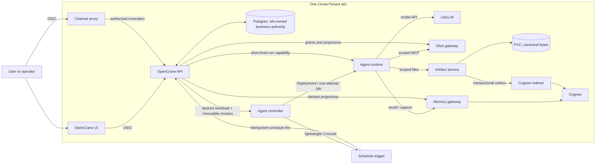

# Personal-agent platform architecture

Status: **proposed for review — 2026-07-16.** This is a decision document, not an accepted
ADR. If the runtime and authority decisions below are accepted, record them in new ADRs and use
either the companion [strangler migration plan](personal-agent-platform-simplification-plan.md) or
the alternative [rewrite-freeze plan](personal-agent-platform-rewrite-freeze-plan.md) as the
accepted execution sequence. The
[OpenClaw loop investigation](openclaw-agent-loop-replacement-plan.md) provides the pinned source
trace, toolkit decision gate, and conformance plan for the runtime slice.

## Decision requested

Adopt a personal-agent platform in which the user's own assistant is the primary product and the
same assistant is the front door to company AI assets. Use one per-ClusterTenant OpenCrane API as
the authority for silo-owned agents, assets, grants, persona, schedules, and runs; keep
fleet-managed membership/lifecycle as explicit upstream contracts. Use one runtime contract, one
artifact authority, one scheduler/controller, and one management console.

The recommended end state is an OpenCrane-owned, OpenClaw-free TypeScript runtime with one
conformance-selected `AgentLoopDriver`. The
[OpenAI Agents SDK](https://openai.github.io/openai-agents-js/) is the leading candidate; Vercel AI
SDK's `ToolLoopAgent` is the control and fallback.
The delivery strategy is a separate decision. The strangler reaches the target through staged
replacement behind `ConversationGateway`, with a deliberately reduced, immutable OpenClaw runtime
as its temporary bridge. The rewrite-freeze route holds the complete blue platform at a supportable
release while green is built without an OpenClaw bridge, then replaces one whole ClusterTenant silo
at a time.

This is a simplification **only if the replacement is exclusive**. Keeping OpenClaw and the selected
driver as permanent peers would create two loop contracts, two session models, two persona paths,
two tool adapters, and two deployment/upgrade matrices. Embedding a second loop beneath OpenClaw is
the most complex option and is explicitly out of scope.

The target can be summarized as five rules:

1. **One silo management authority:** Postgres behind the per-silo OpenCrane API owns agents,
   assets, grants, persona, schedules, and runs. In fleet-managed mode, fleet lifecycle and
   membership remain explicit upstream authorities with a fail-closed silo read model.
2. **One agent loop:** the conformance-selected TypeScript driver in a pinned OpenCrane runtime
   image.
3. **One artifact authority:** content-addressed files on a Kubernetes volume, with metadata in
   Postgres and Cognee as a downstream index.
4. **One agent-workload controller:** the only application identity allowed to create OpenCrane
   agent Deployments, CronJobs, and Jobs. Obot's separately confined upstream controller is the
   narrow exception for MCP-server workloads in its own namespace.
5. **One management path:** OpenCrane API first, OpenCrane UI for people, and only a thin generated
   automation client where a CLI is still justified.

## Why this is the right boundary

OpenClaw is valuable when it supplies the whole personal-agent product: gateway, channels, cron,
sessions, transcripts, compaction, tools, skills, plugins, workspace, and the agent loop. OpenCrane
already owns or intends to own almost every one of those concerns differently:

- OIDC channel ingress and tenant routing;
- custom persona and durable memory through Cognee;
- MCP registration, credentials, and execution through Obot;
- an OpenCrane skill registry and governed skill lifecycle;
- central schedules and managed agents;
- model routing, provider credentials, and budgets through LiteLLM;
- Kubernetes isolation, workload identity, and lifecycle;
- company-wide assets, sharing, audit, and an operational console.

The result is not a light OpenClaw installation. It is an OpenCrane platform translating its own
state into OpenClaw's state. That translation currently includes a 609-line startup script, a
458-line generated ConfigMap, a 271-line OpenClaw schema, and 1,689 lines of frontend protocol and
event adaptation before tests. OpenClaw remains the lower-risk short-term runtime because it already
supplies session and loop behavior, but its long-term role is mostly compatibility work.

The leading Agents SDK candidate has the opposite shape. It supplies the bounded loop, tools,
handoffs, streaming, sessions interface, MCP clients, approvals, guardrails, and tracing hooks. It
does **not** supply a service gateway, scheduler, tenant security boundary, artifact store,
operational console, or durable job system. That smaller boundary fits the platform OpenCrane is
already building. Its [runner](https://openai.github.io/openai-agents-js/guides/running-agents/),
[sessions interface](https://openai.github.io/openai-agents-js/guides/sessions/),
[MCP clients](https://openai.github.io/openai-agents-js/guides/mcp/), and
[approval state](https://openai.github.io/openai-agents-js/guides/human-in-the-loop/) are useful runtime
primitives, not a second control plane.

## Scope and non-goals

This proposal covers:

- personal assistants with stable character and user-owned preferences;
- personal and company-managed agent services using the same runtime;
- interactive, scheduled, and manually triggered runs;
- multimodal input, document authoring, artifacts, and governed Python skill authoring;
- MCP tool use through Obot and memory through Cognee;
- organization, department, team, personal, and direct-share authorization;
- OIDC channel security, workload identity, Cilium policy, audit, observability, and consoles;
- the OpenClaw-retained and owned-loop migration alternatives.

It does not create:

- a global authorization singleton across ClusterTenants;
- business grants in Kubernetes RBAC or Cilium labels;
- a general plugin framework before concrete module contracts exist;
- a general durable-workflow engine before agent Jobs and approval resume prove insufficient;
- a second canonical store inside Cognee, OpenClaw workspaces, OCI, or Kubernetes CRDs;
- unrestricted execution of newly generated Python in a live personal-agent pod.

## Current verified architecture and drift

### What is structurally sound

The accepted per-ClusterTenant silo decision remains the right containment boundary. Each silo owns
its OpenCrane API/database, Cognee, Obot, LiteLLM, agent workloads, and storage. Fleet lifecycle—and
membership in fleet-managed mode—and Zitadel authentication are cross-silo. This preserves
independent data, credentials, resource limits, backup, and failure domains; see
[ADR 0002](../adr/0002-per-clustertenant-silo-architecture.md).

The repo also already has a useful runtime replacement seam:
[`ConversationGateway`](../../libs/frontend/state/core/src/lib/conversation-gateway.types.ts). The UI
can keep its generic conversation contract while the OpenClaw protocol adapter is replaced behind
it.

### What is not a single authority today

[`docs/agents/architecture.md`](../agents/architecture.md) records that Tenant and AccessPolicy
state is dual-written: Kubernetes CRDs are authoritative while Postgres is repaired as a projection.
The same platform also has separate or overlapping state for:

- OpenClaw workspace files and central company/workspace document versions;
- OpenClaw JSONL sessions and a disconnected `SessionScope` table;
- Cognee datasets, bespoke Cognee credentials, and legacy awareness tables;
- MCP access policies, MCP grants, generic grants, credentials, installs, and an effective contract;
- skill bytes in Postgres, OCI/Zot, runtime files, and now-removed shared-PVC assumptions;
- OpenClaw pairing/device records although the browser uses a same-origin authenticated proxy.

Repair loops, translation layers, fallback paths, and compatibility flags are symptoms of these
multiple authorities. They should not be carried into the target.

### Documentation and backlog are not mutually current

The repository currently contains three CRDs—ClusterTenant, Tenant, and AccessPolicy—while some
architecture docs describe six. Obot docs still describe a registry polling path removed by the
deployment. ADR 0003 requires Linkerd removal while dormant Linkerd code and an optimization note
retain it. The root plan still names closed issues and omits several live issues. The companion plan
therefore includes a live issue disposition rather than treating the present roadmap as current.

## Target topology



The diagram separates authority from enforcement:

- OpenCrane is the policy administration and decision point.
- The channel proxy, artifact service, memory gateway, Obot adapter, and runtime are enforcement
  points. They do not invent grants.
- The agent controller is the only general OpenCrane agent-workload mutator. Obot's controller has
  a separate, constrained role for MCP-server workloads in its isolated namespace.
- Cilium limits which workload identities can reach each enforcement point.
- Kubernetes RBAC controls Kubernetes API access only.

## First-class applications and modules

First-class does not mean “one microservice per noun.” An application is justified where there is a
different trust boundary, scaling/lifecycle boundary, or stateful data path. Everything else remains
a logical module in the OpenCrane API.

| Unit | Target responsibility | Authority or privilege | Change from today |
|---|---|---|---|
| `apps/opencrane` | Per-silo management API, identity binding, agent/persona/skill/artifact metadata, business authorization, approvals, audit | Sole authority for silo-owned business state; fleet membership/lifecycle is an upstream contract; no broad Kubernetes mutation | Keep and narrow |
| `apps/opencrane-ui` | Agent, asset, schedule, run, approval, access, and operations console | Client of the API only | Keep and complete |
| `apps/channel-proxy` | Same-origin ingress, origin checks, delegated OpenCrane session/OIDC resolution, stream relay, rate limits | Internet-facing PEP; no session/policy storage or K8s mutation | Extract the existing gateway proxy without duplicating auth logic |
| `apps/agent-controller` | Consume desired state through an authenticated OpenCrane internal API; reconcile AgentService records into Deployments/CronJobs/Jobs/KSAs/policies; report execution status | Sole general agent-workload K8s mutator; no direct business-policy writes | Extract controller/scheduler responsibility from the API process |
| `apps/agent-runtime` | Pinned TypeScript image with the selected toolkit loop, normalized events, MCP and trusted tool adapters | Zero K8s API rights; per-run capability only | Create; replaces OpenClaw at cutover |
| `apps/artifact-service` | Stage/scan/hash/stream canonical bytes, content-addressed versions, workspace leases, retention | Owns its PVC and enforces artifact capabilities; no policy store | Create; absorbs skill delivery bytes |
| `apps/cognee` | Pinned upstream deployment, PVC, SA, probes, backup, upgrade tests; memory/index adapters | Derived memory/index data only | Promote embedded Helm templates to an app-owned unit |
| `apps/obot` | Pinned upstream gateway/controller, credential custody, tool execution, constrained runtime namespace | MCP PEP; privileged controller isolated from callers | Promote embedded Helm templates and narrow RBAC |
| `apps/opencrane-infra` | Per-silo umbrella composition and a small deployment profile | No feature ownership | Keep, but consume app-owned deploy units |
| LiteLLM | Model routing, provider keys, aliases, budgets, capability matrix | Model/provider PEP | Keep pinned and per silo |

Logical modules that should **not** become separate applications initially:

- `libs/authorization/{contracts,engine}` inside `apps/opencrane`;
- agent, revision, run, trigger, persona, skill-catalog, and sharing domains;
- transactional outbox and audit ledger;
- approval and run-coordination state;
- model-policy compilation.

An independently deployed authorization service is justified only if the API cannot meet decision
latency/availability or several independently deployed PEPs require online checks that signed
capabilities cannot satisfy. If extracted, it remains per ClusterTenant and uses the same policy
store; it must not introduce a second relationship database.

### Where an optional open-source module fits

The lean default is the smallest existing primitive that meets the requirement. More capable
open-source systems remain replaceable modules, not mandatory core dependencies:

| Need | Lean default | Optional module and adoption trigger |
|---|---|---|
| Relationship authorization | Existing grant compiler behind `libs/authorization` | [OpenFGA](https://openfga.dev/docs/concepts) when nested relationship checks, scale, or explanation needs outgrow the local engine |
| Policy rules over structured context | Typed code and shared conformance fixtures | [OPA](https://www.openpolicyagent.org/docs) when independently authored policy bundles and a distinct policy lifecycle are proven needs |
| Scheduling/retry | Lightweight Kubernetes CronJob trigger + transactional AgentRun + controller-created one-attempt Job | [Argo Workflows](https://argo-workflows.readthedocs.io/en/latest/) for real DAG execution; [Temporal](https://docs.temporal.io/) or [Restate](https://docs.restate.dev/) for frequent multi-day durable orchestration/compensation |
| Artifact bytes | Thin POSIX content-addressed service on the existing K8s storage class | S3-compatible or distributed storage only when multi-writer scale, replication, or external object clients require it; no object API by default |
| Agent loop | Conformance-selected OpenCrane `AgentLoopDriver`; OpenAI Agents SDK is the leading candidate | OpenClaw compatibility adapter during migration; no permanent second loop |
| Memory/index | Cognee behind an OpenCrane gateway | Replaceable through the memory adapter; never the artifact authority |
| MCP runtime | Obot behind a validating gateway | Replaceable through the MCP adapter; never the grant authority |
| Operational telemetry | Existing OpenTelemetry pipeline and OpenCrane run ledger | Langfuse for optional prompt evaluation/annotation, not required platform operation |
| Skill/document execution | Isolated Kubernetes Jobs with explicit profiles | A sandbox/workflow product only after the Job boundary fails measured isolation or throughput needs |

This modularity is intentionally asymmetric: adding a module is allowed behind a contract; adding a
second authority, scheduler, transcript, or agent loop is not.

## Central authority and authorization

### Three systems, three questions

| Mechanism | Question it answers | Must not answer |
|---|---|---|
| OpenCrane authorization | May this person or agent invoke, read, revise, share, publish, approve, or administer this business resource? | Kubernetes object mutation |
| Kubernetes RBAC | May this ServiceAccount call this Kubernetes API verb on this object kind? | Team membership, artifact access, tool grants |
| Cilium policy | May this workload identity connect to this service/port/path? | Request-level user or direct-share permission |

Do not encode organization, department, team, user, or direct-share grants as Cilium identities.
Those relationships change frequently and require request context. Cilium should use stable
namespace, application, and ServiceAccount identities for default-deny and service reachability.
The [Cilium ServiceAccount policy model](https://docs.cilium.io/en/stable/security/policy/kubernetes/#serviceaccounts)
supports that layer; its L7 controls can additionally constrain service paths, but they are still
not business authorization.

ADR 0003 should be corrected before implementation. Current Cilium identities are label-derived
numeric security identities; custom SPIRE SVIDs are not interchangeable with them. Cilium
[mutual authentication is documented with limitations](https://docs.cilium.io/en/stable/network/servicemesh/mutual-authentication/mutual-authentication/#limitations)
and should not be the baseline business trust mechanism. Use projected KSA tokens and application
capabilities first; retain SPIRE as an optional later identity layer.

### Business relationship model

Add principals:

- organization, department, team, user, and explicit subject set;
- `AgentService`, immutable `AgentRevision`, and `AgentRun`;
- workload identity and delegated interactive user.

Add resources:

- agent/service, revision, run, schedule, transcript, and logs;
- artifact and artifact version;
- memory dataset/index projection;
- MCP server and tool;
- skill and skill revision;
- approval and publication request.

Use actions such as `discover`, `read`, `write`, `invoke`, `trigger`, `revise`, `share`, `delete`,
`publish`, `approve`, `readLogs`, and `administer`. Direct sharing is simply one or more grants to
named users; it does not need a special Kubernetes primitive.

The existing `project` scope cannot disappear implicitly. Gate 0 must either retain project as a
first-class subject/group or migrate each project relationship to a named team/department construct
with verified membership and access parity.

The effective rights for a run are:

```text
agent revision ceiling
  intersect triggering-user delegation, when interactive
  intersect current resource grants
  intersect immutable short-lived run capability
```

A scheduled service acts as its own `AgentService` principal, not as the user who originally
created it. An interactive personal assistant carries a delegated human context whose rights can
only reduce the agent's ceiling. A child/specialist agent receives a smaller capability; delegation
must be monotonic.

The first implementation can use the existing grant compiler behind a typed authorization facade.
[OpenFGA](https://openfga.dev/docs/concepts) is a plausible later engine if nested relationship
graphs and high-volume checks justify it. Adopting OpenFGA, OPA, or another PDP now would add a data
synchronization and operating problem before the resource/action model itself is stable.

### Membership authority and freshness

“Central port of authority” does not mean pretending fleet-owned membership is local. In a
fleet-managed install, the fleet `OrgMembership` store remains authoritative and the silo has an
explicit read model. In standalone mode, the silo owns the same membership contract locally.

The read model needs source version, last successful sync, and freshness policy. Capability issuance
must fail closed when membership is too stale for the requested action: no new membership-derived
privilege or administrative capability is issued beyond the accepted freshness window, and existing
short-lived capabilities expire naturally. Membership writes in fleet-managed mode go through the
fleet authority; the silo never creates a competing local truth. Gate 0 must set the freshness/expiry
SLO and outage behavior before the new authorization engine relies on this projection.

### Identity flow

1. The channel proxy rejects missing/disallowed origins, strips public identity headers, and passes
   only the session cookie/token plus trusted host to OpenCrane's authenticated internal resolver.
2. OpenCrane validates OIDC/session issuer, audience, signature, expiry, revocation, and subject;
   resolves the ClusterTenant from the host; enforces membership freshness; and authorizes the
   requested agent/thread action. The proxy holds no independent session or JWKS logic.
3. OpenCrane returns only the authorized route and a short-lived invocation context, then creates or
   resumes the run. The proxy-to-OpenCrane path is workload-authenticated and network-restricted.
4. The controller registers an assignment binding the AgentService/Run/revision to the created
   namespace, workload profile and workload UID. A suspended Job first receives a single-use
   bootstrap bound to its Job UID and projected only by that Job's pod template. After unsuspension,
   the controller registers the Job's first Pod UID before exchange is allowed; a different Pod UID
   under that Job is rejected. A long-lived personal Deployment receives a one-time run assignment
   challenge for its already registered Pod UID. The runtime cannot request an arbitrary run by ID.
5. The runtime authenticates with that bootstrap/assignment plus an explicitly projected KSA token
   whose audience is `opencrane`; default token automount is disabled. OpenCrane TokenReviews the
   full namespace/SA/Pod UID, atomically consumes the bootstrap, verifies the controller assignment
   and Job ownership where applicable, and binds the context to an ephemeral pod/run proof key.
6. OpenCrane returns a short-lived run context containing IDs, revision/grant hashes, allowed scopes,
   budgets, and expiry—not broad credentials. PEPs do not accept the run context directly.
7. The runtime exchanges the context for a narrower action capability. Repeatable read, stream, and
   upload-lease capabilities are proof-of-possession-bound and short-lived. A mutating or tool-call
   capability additionally binds resource, action, arguments hash, and `jti`; the PEP atomically
   records that ID/result for one-shot or idempotent replay handling. A nonce claim by itself is not
   replay protection. High-risk and revocation-sensitive actions also perform an online check.
8. Every decision records actor, workload, resource, action, policy/revision hash, outcome, and
   reason in the audit ledger.

The current projected-ServiceAccount parser tracked in
[#221](https://github.com/italanta/opencrane/issues/221) must use namespace plus full ServiceAccount
identity. Dropping a name prefix or namespace is not an acceptable basis for the new model.

## Unified agent service model

Replace the OpenClaw-specific UserTenant as the product model with an `AgentService` model used by
both personal and company-managed agents.

### Core records

| Record | Purpose |
|---|---|
| `AgentService` | Stable identity, kind (`personal` or `managed`), owner, lifecycle, active revision, deployment policy, workload-profile binding |
| `AgentRevision` | Immutable prompt/persona references, model policy, skills, MCP assignments, budgets, guardrails, input/output schema, triggers |
| `AgentRun` | Actor/trigger, revision, effective-contract hash, attempt, state, timestamps, costs, terminal reason |
| `RunEvent` | Ordered normalized model/tool/approval/artifact/status events for reconnect, console, and audit |
| `Thread` / `Message` | Canonical user-visible transcript independent of runtime implementation |
| `ApprovalRequest` | Exact revision, tool, arguments, approver policy, expiry, decision, resume token |
| `PersonaProfile` / `PersonaRevision` | User-owned personal-assistant identity and versioned company/user layers |
| `PreferenceFact` | Explicit or inferred preference, provenance, confidence, sensitivity, consent state, correction history |
| `Artifact` / `ArtifactVersion` | Logical asset, immutable bytes, MIME/type, provenance, lineage, owner, retention, index state |
| `Skill` / `SkillRevision` | Manifest, instructions/code references, tests, scan result, trust class, publication state |

Kubernetes objects are projections of these records. Do not add Agent, MCP, Skill, or Schedule CRDs
unless an independent GitOps author must own them. The OpenCrane API is the only supported writer.

### Personal and managed workloads

- A personal agent normally has one stable Deployment per user inside the ClusterTenant. It may
  scale to zero because transcript, persona, memory, and artifacts live outside the pod.
- A scheduled managed agent is represented by an AgentService and immutable AgentRevision. The
  controller renders a lightweight CronJob whose only job is to call an idempotent OpenCrane
  schedule-fire endpoint. OpenCrane transactionally creates the `AgentRun` and outbox command before
  the controller creates any runtime Job.
- The controller creates each runtime attempt as a suspended Job with `backoffLimit: 0`, records the
  Job UID and one-shot bootstrap assignment, then unsuspends it. It registers the first Pod UID
  before bootstrap exchange; a different Pod under that Job cannot inherit the assignment. A retry
  is a new recorded attempt and a new Job, never an opaque Kubernetes replacement pod under the
  previous capability.
- A manually triggered managed agent enters the same `AgentRun`/outbox/Job path without a CronJob
  firing.
- Ordinary personal and scheduled workloads use a bounded set of runtime-profile KSAs because their
  request-level identity comes from the `AgentRun` capability. Give an AgentService a dedicated KSA
  only when it needs distinct cloud IAM or network reachability. Large fleets of short jobs use a
  bounded executor KSA pool plus unique short-lived capabilities. Never create a unique
  ServiceAccount or Cilium identity for every run or encode user/team scope in identity labels.
- Runtime pods have zero Kubernetes API RBAC. Only `apps/agent-controller` creates or patches agent
  workloads. The privileged Obot runtime controller is separately confined to its own namespace.

## The personal assistant and its “soul”

The personal assistant is the primary objective, not a thin shell around company infrastructure.
Its continuity should be deliberately modeled rather than accumulated in mutable prompt files.

Compile every run from four versioned layers:

1. **Platform contract:** security, tool ceilings, budgets, and non-user-editable behavior.
2. **Company layer:** company identity, terminology, values, and shared working conventions.
3. **Personal layer:** the user's chosen assistant identity, tone, communication style, working
   habits, boundaries, and approved preference facts.
4. **Run context:** recalled memories, relevant company assets, thread history, and temporary
   conversational adaptation.

This is not a rule against learning. It is a rule against silent, unauditable mutation:

- explicit user statements such as “always give me the conclusion first” can become durable facts;
- low-risk inferred preferences become visible candidates and graduate after repeated evidence or
  confirmation;
- sensitive traits are never inferred into the persona;
- every fact exposes why it was remembered and can be corrected, forgotten, or scoped;
- a PersonaRevision is deterministic, reviewable, and reversible;
- Cognee stores durable supporting memory and knowledge, but does not secretly become the system
  prompt authority.

Recalled memory, uploaded documents, MCP responses, and generated artifacts are always untrusted
content. They cannot grant tools, alter the platform/persona layers, or inject new system
instructions. The prompt compiler preserves source and scope provenance, separates instructions
from retrieved content, and the run capability—not retrieved text—determines available actions.

Specialist agents should normally be invoked as tools so the personal assistant remains the
manager and final voice. A true handoff is reserved for cases where the user should consciously
enter another agent. This keeps the personal relationship intact while making the assistant the
window into company-wide skills, artifacts, schedules, and agents.

Personal memory never automatically becomes a company asset. The assistant may draft an artifact,
skill, or managed AgentRevision from a personal conversation, but promotion crosses an explicit
review and sharing boundary.

The boundary is one-way by default: a personal assistant may invoke a managed agent using an
authorized tool contract, but that managed agent cannot inspect the personal workspace, thread,
memory, filesystem, or logs. It receives only explicitly shared ArtifactVersions and declared input
fields in its narrower capability. Publishing a managed agent or company artifact never grants it
retroactive access to the conversation that produced the draft.

## Artifacts, documents, memory, and skills

### Artifact authority

Use ordinary filesystem semantics, not an S3 requirement:

- canonical bytes live in a content-addressed layout on an `apps/artifact-service` PVC, for example
  `sha256/ab/<digest>`;
- Postgres holds artifact IDs, versions, owner, MIME/type, size/hash, lineage, provenance, grants,
  retention, and derived-index status;
- every upload is written to a temporary path, scanned, hashed, atomically promoted, and committed
  with an outbox event;
- backup uses the chosen Kubernetes storage provider's snapshots plus database-consistent metadata;
- the API hides the storage backend so an RWX filesystem or another blob backend can be introduced
  later without changing agent contracts.

The write protocol preserves the single authority: OpenCrane authorizes and creates an upload lease;
the artifact service stages, scans, hashes, and idempotently promotes the bytes into the CAS; then an
authenticated internal finalize call commits ArtifactVersion metadata and the outbox event in one
OpenCrane transaction. A failed finalize leaves only an unreferenced digest for garbage collection,
never a visible metadata row pointing to incomplete bytes. Deletes are first marked in OpenCrane and
are physically purged only after index-removal and retention gates complete **and** a transactional
live-reference/lease check proves no other ArtifactVersion uses the digest. Garbage collection uses
a race-safe reference count or mark-and-sweep generation; deleting one logical version can never
delete shared bytes still referenced by another.

The artifact service is a separate application because it owns streaming byte I/O, a stateful disk,
malware/content scanning, and a different scaling path. It is not another policy authority.

### Cognee as downstream index

Cognee is not the blob store. Artifact events drive indexing:

- `ArtifactVersionPublished` queues extraction and `cognify` into the authorized dataset;
- `ArtifactSharingChanged` updates the projected dataset relationship;
- `ArtifactDeleted` removes the derived Cognee content before retention finally purges the bytes;
- failures retry from the outbox and are visible as index lag in the artifact/run console;
- artifact version IDs and Cognee external IDs are recorded so removal is deterministic.

Cognee's documented dataset permissions can implement a local projection of read/write/delete/share
rights, but OpenCrane remains the source of those grants. Runtime access goes through a small memory
gateway using run capabilities; per-user Cognee passwords and unrestricted direct pod access are
removed after migration.

### Multimodal and document authoring

Messages refer to ArtifactVersion IDs rather than shipping ungoverned file paths through the agent
protocol. A preprocessing pipeline creates model-ready derivatives:

- image normalization and OCR;
- PDF/text extraction and page renders;
- audio transcription;
- video metadata, audio, and selected frames;
- office-document rendering and structural extraction.

The model capability matrix in LiteLLM/OpenCrane selects a compatible model or a deterministic
preprocessor. The leading Agents SDK candidate supports image/file inputs and tool file/image
outputs, but provider support varies and there is no complete video workflow; OpenCrane owns
normalization.

Document authoring is implemented as trusted tools operating in an isolated workspace. A run
produces a new ArtifactVersion, renders it, validates it, and returns a preview/reference. A local
file created inside a runtime pod is never the durable artifact.

### Governed Python skill authoring

Skills are versioned artifacts, not executable snippets appended to a personal workspace:

1. The personal assistant creates a candidate skill bundle containing `SKILL.md`, Python code,
   tests, declared MCP/model/network requirements, and provenance.
2. A dedicated authoring Job receives only a draft workspace capability. It has no production MCP
   credentials and default-deny egress.
3. The job runs formatting, types/tests, dependency/license checks, secret and malware scans, and
   policy validation.
4. A human or authorized publishing workflow reviews the diff and test evidence.
5. OpenCrane signs and publishes an immutable SkillRevision.
6. Runtime contracts reference the digest. Trusted image-baked tools may execute in-process;
   tenant-authored Python executes through an isolated tool Job, not inside the conversational pod.

This preserves Python as the preferred authoring language without treating the ordinary runtime pod
as a security sandbox. The leading candidate's beta sandbox/skill facilities may be evaluated, but
they are not the platform security boundary.

The current Postgres/OCI/Zot/runtime-file delivery paths collapse into the artifact service plus
logical skill catalog. OCI becomes an optional export adapter only if cross-cluster or third-party
distribution is proven necessary.

## MCP and Obot boundary

Obot remains credential custodian and MCP execution PEP. OpenCrane owns the catalog, assignment,
business grants, and run capability. The runtime connects over streamable HTTP with a narrow token;
tool filtering shapes what the model sees but is not treated as authorization.

The current Obot controller can create Secrets, ServiceAccounts, pods, Deployments, Roles, and
RoleBindings across a namespace. Constrain it as follows:

- isolate the privileged upstream controller in an Obot runtime namespace;
- expose only an unprivileged gateway/adapter to agent workloads;
- apply admission policy for permitted images, resources, ServiceAccounts, and object kinds;
- disable default token automount where possible and explicitly project needed audiences;
- if upstream Obot cannot validate OpenCrane capabilities, place a thin validating gateway in front
  of it;
- remove stale registry-poll network allowances and duplicate application health polling once
  Kubernetes probes and conformance checks cover them.

Obot API keys can be scoped to servers/capabilities and expiry, but they are a downstream
enforcement credential, not a replacement for the OpenCrane relationship model.

The memory gateway and Cognee indexer shown in the topology are OpenCrane-owned adapter deployments
packaged by `apps/cognee`; they are not separate policy authorities or separately configurable
products. They may share one adapter process until measured load requires independent scaling.

## Scheduling and workflows

“Workflow” currently conflates three different systems:

| Layer | v1 implementation | When to add more |
|---|---|---|
| Agent loop | Conformance-selected `AgentLoopDriver` with turn/tool/deadline/budget limits | Never duplicate it in the controller |
| Service scheduling and retry | OpenCrane registry/run ledger + lightweight CronJob trigger + controller-created one-attempt Job | Add a queue only when Job creation/throughput requires it |
| Long-lived business workflow | Persisted AgentRun, ApprovalRequest, serialized resume state, new Job on resume | Add Temporal/Restate only after multi-day branching, compensation, or cross-service guarantees are recurrent |

Kubernetes supplies wake-up timing, Job deadlines, termination, and workload status. OpenCrane
supplies business identity, immutable revision, concurrency/retry policy, run/attempt ledger,
capability, artifact links, approvals, and user-facing status. A schedule-trigger CronJob never runs
the agent itself. Do not run OpenClaw cron, a custom timer loop, and trigger CronJobs in parallel.

An approval binds the exact agent revision, tool, arguments hash, run, capability version, eligible
approvers, and expiry. Resuming creates a new Job attempt with a fresh capability. Serialized
toolkit continuation state can contain sensitive context and must be encrypted and
retention-governed.

## Consoles and operations

The OpenCrane UI is the normal management surface. Upstream Cognee, Obot, Langfuse, and Kubernetes
consoles are operator diagnostics, not parallel sources of configuration.

The UI needs six coherent views:

1. **Personal assistant:** persona, remembered preferences with provenance, memory controls,
   connected tools, model/budget, and conversation.
2. **Agent catalog:** personal and managed AgentServices, revisions, owners, skills/MCPs, scopes,
   publish/rollback, and effective contract.
3. **Schedules and runs:** next/last firing, live event stream, attempts, cancel/retry, costs,
   artifacts, checkpoints, and failure reason.
4. **Approval inbox:** exact requested action, arguments/diff, affected resources, policy, expiry,
   approve/reject/resume.
5. **Assets:** artifacts, versions, previews, lineage, sharing, Cognee index state, and deletion.
6. **Security and operations:** effective access explorer, audit decisions, denied calls, component
   health, queue/index lag, runtime versions, and links to cluster telemetry.

API endpoints remain authoritative. The frontend and any CLI use the same generated client. Issue
[#216](https://github.com/italanta/opencrane/issues/216) should remove duplicated CLI business
logic: retain only bootstrap, automation, and break-glass commands with proven users; otherwise
retire the CLI after equivalent API/UI/runbook coverage exists.

## Observability and operational records

Separate operational telemetry from business evidence:

- OpenTelemetry traces, structured logs, and metrics go through the existing OpenCrane
  observability pipeline;
- `AgentRun`, `RunEvent`, `ApprovalRequest`, `AuditDecision`, and artifact lineage remain durable
  business records in Postgres;
- every signal includes ClusterTenant, AgentService, AgentRevision, AgentRun, attempt, and trace IDs;
- prompts, tool arguments, outputs, and artifact contents are redacted or omitted by default;
- cost, latency, model/provider, token counts, tool outcomes, retry, cancellation, and index lag are
  measured without requiring content capture;
- any toolkit-default external tracing export is disabled and replaced with an OpenCrane trace
  processor.

Langfuse can remain an optional evaluation/annotation module. It should not be the required run
console or the only trace store, because its bundled ClickHouse/Valkey/object-storage dependencies
are a large per-silo operating cost.

## Runtime-neutral conversation contract

Keep `ConversationGateway` as the product seam, but make its server protocol OpenCrane-owned and
small:

- list/open threads and cursor-paged history;
- send a multimodal message by artifact reference;
- stream ordered run, text, tool, approval, artifact, usage, and terminal events;
- reconnect from an event cursor;
- abort a run and observe terminal reconciliation;
- submit an approval decision;
- expose no OpenClaw admin, cron, channel, node, device, or configuration protocol.

In the recommended OpenClaw-free target, OpenCrane owns the canonical transcript and event log. The
selected driver receives an explicit context projection or a custom session adapter for each run;
neither is the product's transcript authority. Compaction creates a versioned summary with
provenance while retaining the immutable transcript under retention policy. Provider-specific
compaction may be used when supported, but a provider-neutral fallback is required behind LiteLLM.
A deliberately retained OpenClaw target instead leaves transcript/session authority in OpenClaw
and accepts that continuing exception; it must not dual-write every event into a competing
canonical transcript.

## Scenario comparison

### Scenario A — retain a lean OpenClaw runtime

Keep:

- OpenClaw loop, transcript/session engine, compaction, cancellation, and tool execution;
- the OpenCrane OIDC proxy, cluster lifecycle, grants, Obot, Cognee, LiteLLM, artifact service, and
  scheduler;
- a narrow OpenClaw adapter behind `ConversationGateway`.

Change immediately:

- build an immutable image containing a pinned OpenClaw and Cognee integration—no startup npm
  installation or self-updater;
- disable OpenClaw cron, channels, nodes, pairing/device auth, built-in memory, and configuration
  mutation;
- make central PersonaRevision and the effective runtime contract the only platform inputs;
- remove dead shared-skills, CSV MCP policy, arbitrary config overrides, and unused CRD fields;
- stop claiming editable pod workspace files are authoritative.

This is the shortest path to a safer next release. It still retains OpenClaw configuration/schema
translation, gateway protocol and event folding, plugin upgrades, workspace compatibility,
transcript semantics, and renderer/A2UI version lockstep. It is a cleaner bridge, not the leanest
end state.

### Scenario B — OpenCrane-owned toolkit loop

Keep everything above OpenClaw: the product conversation interface, OIDC proxy, controller,
workload builders, Obot, Cognee, artifacts, LiteLLM, grants, persona, and generic rendering.

Build:

- TypeScript `apps/agent-runtime` with the conformance-selected bounded loop driver; the OpenAI
  Agents SDK `Agent`/`Runner` path is the leading candidate and AI SDK is the control;
- an explicit OpenCrane context projection, plus a toolkit-specific session adapter only when the
  selected driver requires it; a transcript/event adapter, run lock, idempotency, abort/recovery,
  and compaction policy;
- direct Obot MCP and Cognee memory adapters;
- normalized multimodal/artifact events;
- persisted approvals and resume;
- isolated document and Python-skill authoring Jobs;
- custom OTEL tracing and conformance tests.

Use the selected TypeScript provider adapter against the existing LiteLLM OpenAI-compatible proxy.
Pin it exactly and test the model/provider capability matrix. Do not use toolkit-local filesystem or
session memory as durable user memory.

After parity and migration, delete the entire OpenClaw installer/config/protocol/plugin/workspace
compatibility surface. This has a larger delivery cost but one coherent personal and managed-agent
runtime afterward.

### Feature distance from the target

Distance means engineering and migration distance, not product importance: **near** is mostly
hardening/deletion, **medium** is a new contract or bounded component, and **far** is a new stateful
capability with operational recovery and UI.

| Feature | Current repo | Lean OpenClaw | OpenClaw-free end state | Final authority |
|---|---|---|---|---|
| Personal loop and streaming | Mature OpenClaw loop through a large adapter | **Near:** narrow and harden | **Far:** runner, event adapter, locks, recovery | Runtime plus Run ledger |
| Threads/transcripts/compaction | OpenClaw JSONL; orphan SessionScope | **Near:** retain, connect scope | **Far:** canonical transcript/session/compaction | OpenCrane Postgres |
| Stable persona and learning | Split workspace files, company docs, Cognee | **Medium:** prompt compiler to files | **Medium:** prompt compiler to run | PersonaRevision; Cognee evidence |
| OIDC channel security | Same-origin proxy exists; pairing residue | **Near:** remove residue | **Near:** route new protocol | Channel proxy + OpenCrane authz |
| Org/team/personal/direct-share RBAC | Grants exist but agent/run/actions are incomplete | **Medium** | **Medium** | OpenCrane authorization |
| Workload identity/Cilium | Projected tokens partial; Cilium substrate incomplete | **Medium/high** | **Medium/high** | KSA + capabilities + Cilium PEP |
| MCP/tool calling | OpenClaw tools plus incomplete Obot lifecycle | **Medium:** finish Obot boundary | **Medium:** direct MCP adapter | OpenCrane grants; Obot PEP |
| Durable memory | Cognee plugin/account lifecycle exists | **Medium:** contain plugin | **Medium:** direct gateway adapter | Cognee data; OpenCrane policy |
| Artifact storage/sharing | No canonical artifact service | **Far** | **Far** | Artifact service + Postgres metadata |
| Multimodal intake | Runtime/provider-dependent, no governed pipeline | **Medium/high** | **Medium/high** | Artifact/preprocess pipeline |
| Document authoring | Ad hoc tool/files, no versioned QA path | **Far** | **Far** | Artifact and trusted authoring Jobs |
| Skill authoring and Python code | Multiple storage paths; lifecycle issue open | **Far** | **Far** | Skill catalog + artifact versions |
| Managed agent registry | Central-agent issue/app is Slack-specific | **Far** | **Far** | AgentService/Revision |
| Scheduling | OpenClaw cron unused; generic service scheduler absent | **Medium/high** | **Medium/high** | OpenCrane run ledger + K8s trigger/Job |
| Approvals/durable workflows | No unified run/approval ledger | **Far** | **Medium/high:** toolkit pause state may help | OpenCrane Run/Approval state |
| Run/operations console | Fragmented UI and infra consoles | **Far** | **Far** | OpenCrane UI/API |
| Observability/audit | OTEL library exists; runtime correlation incomplete | **Medium** | **Medium** | OTEL plus business ledger |
| Personal per-user isolation | UserTenant pod model exists | **Near** | **Medium:** reuse builders with new image | Agent controller/Kubernetes |
| Runtime upgrades | Startup install/canary residue | **Medium:** immutable image | **Medium:** pin and conformance suite | Image release pipeline |

Most of the requested company-platform work—artifacts, authorization, scheduling, skill lifecycle,
and consoles—is required in **both** scenarios. OpenClaw mainly saves the first two rows. The owned
runtime route is justified by eliminating the long-term adapter and letting personal and managed
agents use the same run/security model, not by avoiding platform work.

## Keep, absorb, and remove

### Keep and strengthen in either scenario

- per-ClusterTenant silo boundary and ClusterTenant CRD at the fleet contract;
- `apps/opencrane`, `apps/opencrane-ui`, and `apps/opencrane-infra` composition role;
- `ConversationGateway` and generic conversation/rendering models;
- OIDC proxy behavior, rate limiting, tenant target resolution, and full-runtime cut;
- LiteLLM model/provider/budget boundary;
- Obot, Cognee, Postgres, projected ServiceAccount tokens, NetworkPolicy/Cilium, and the existing
  observability library;
- Kubernetes workload builders after renaming them to runtime-neutral concepts.

### Absorb into clearer authorities

- `apps/feat-central-agents` becomes AgentService + schedule + MCP/skill assignments;
- `apps/feat-skill-registry` becomes logical skill catalog plus artifact delivery;
- skill bytes and documents become ArtifactVersions on disk;
- company/workspace docs become PersonaProfile/PersonaRevision/PreferenceFact where they define
  assistant identity; ordinary content becomes artifacts;
- awareness ingestion/cursors become managed agent runs/checkpoints; Cognee remains the index;
- gateway proxy code moves to `apps/channel-proxy`;
- tenant runtime reconciliation and scheduling move to `apps/agent-controller`.

### Remove in either scenario after bounded gates

- dead shared-skills scanning/symlinks and `/shared-skills` image paths;
- CSV MCP policy parsing and unused `Tenant.spec.mcpPolicy`/`channels` fields;
- runtime self-install/update and the unused OpenClaw canary rollout path;
- `/auth/pod-token`, BrokeredDevice recording, legacy pairing endpoints, and no-op gateway admin;
- arbitrary `configOverrides` and whole `org-shared-secrets` broadcast;
- disconnected `SessionScope` CRUD unless replaced by a consumed signed run scope;
- legacy awareness content/rollout/participation tables after data migration;
- Postgres/OCI/runtime-file dual-write and fallback after artifact cutover;
- Zot as a required core component unless external OCI distribution is proven;
- Linkerd code after the Cilium baseline is live;
- fleet, billing, shared-platform, and implicit topology values already moved or unused;
- stale docs that describe removed CRDs, Obot polling, pairing, or shared skills.

### Remove only after the OpenCrane runtime cutover

- `apps/feat-openclaw-tenant` and its startup/config renderer/schema;
- OpenClaw gateway protocol schemas, connection client, event folding, and version shims;
- OpenClaw workspace marker/render compatibility and mutable workspace persona files;
- OpenClaw-specific fields, URLs, env vars, tests, renderer/A2UI coupling, and naming;
- Cognee plugin/account lifecycle used only to satisfy OpenClaw;
- OpenClaw transcript/session/compaction compatibility.

## Does this actually simplify operations?

### It becomes simpler in these dimensions

- one place to answer “what should exist?” and “who may use it?”;
- one agent definition for personal and managed services;
- one runtime image and security contract across Deployments and Jobs;
- one artifact lifecycle and one downstream-index path;
- no CRD/Postgres dual-write for business state;
- no OpenCrane-to-OpenClaw config/protocol/persona/tool-policy translation;
- fewer credential kinds and no browser/pod device fiction;
- UI, API, and automation all traverse the same management API;
- upstream apps are pinned, app-owned modules rather than anonymous umbrella-chart templates.

### It becomes harder in these dimensions

- OpenCrane owns session correctness, stream reconnect, cancellation, recovery, compaction, and run
  persistence instead of inheriting them from OpenClaw;
- the artifact service and controller become production components with backups, migrations, SLOs,
  and on-call responsibility;
- safe document/code authoring requires isolated Jobs and a publication pipeline;
- Postgres-driven Kubernetes reconciliation needs an outbox, idempotency, status, and repair loop;
- the selected toolkit, LiteLLM, and model-provider compatibility must be pinned and tested.

Those costs are justified only because they implement OpenCrane's intended product behavior. They
are not justified if OpenClaw remains a permanent second runtime. The strangler plan therefore uses
deletion gates, a time-bounded dual-run window, and an explicit stop/go conformance spike. The
rewrite-freeze plan instead uses a frozen blue release, isolated green construction, deterministic
migration rehearsals, and atomic whole-silo cutovers.

## Proposed decision gates

The following decisions should be accepted together before implementation issues are rewritten:

1. The end state is one OpenCrane-owned, OpenClaw-free runtime with a conformance-selected loop
   driver; choose one delivery strategy. Lean OpenClaw is a temporary bridge only in the strangler.
   The rewrite-freeze green release contains no OpenClaw bridge.
2. Postgres/OpenCrane is the source of truth for silo-owned business state; fleet-managed membership
   and lifecycle remain explicit upstream contracts, and Kubernetes is execution state.
3. The ClusterTenant CRD remains at the fleet/silo boundary; Tenant and AccessPolicy CRDs are
   retired after migration.
4. Artifact bytes live on a per-silo filesystem/PVC; Cognee is a downstream derived index.
5. Authorization is a per-silo OpenCrane module first, with signed run capabilities; no global PDP.
6. Cilium is a workload-network PEP, not user/team RBAC; Linkerd is removed.
7. The agent controller and channel proxy are separate trust-boundary apps; other domains stay
   modules unless evidence demands extraction.
8. New Python code executes only through an isolated authoring/tool Job and immutable publication.
9. OpenClaw and the selected replacement loop are not supported as permanent parallel product
   runtimes.

## Primary evidence

Repository evidence:

- [platform identity and current dual-write model](../agents/architecture.md)
- [per-ClusterTenant silo decision](../adr/0002-per-clustertenant-silo-architecture.md)
- [current Cilium/SPIFFE decision](../adr/0003-cilium-spiffe-identity-substrate.md)
- [cluster topology](../agents/cluster-architecture.md)
- [MCP and skills platform brief](../briefs/mcp-skills-platform-brief.md)
- [OpenClaw runtime entrypoint](../../apps/feat-openclaw-tenant/deploy/entrypoint.sh)
- [OpenClaw config renderer](../../apps/opencrane/src/reconcilers/tenants/deploy/2-config-map.ts)
- [OpenClaw frontend adapter](../../libs/frontend/state/conversation/adapter/src/lib/openclaw-conversation-gateway.ts)

Upstream evidence:

- OpenAI Agents SDK JS: [overview](https://openai.github.io/openai-agents-js/),
  [runner](https://openai.github.io/openai-agents-js/guides/running-agents/),
  [sessions](https://openai.github.io/openai-agents-js/guides/sessions/),
  [tools](https://openai.github.io/openai-agents-js/guides/tools/),
  [MCP](https://openai.github.io/openai-agents-js/guides/mcp/),
  [approvals](https://openai.github.io/openai-agents-js/guides/human-in-the-loop/), and
  [tracing](https://openai.github.io/openai-agents-js/guides/tracing/)
- OpenClaw: [gateway protocol](https://docs.openclaw.ai/gateway/protocol),
  [sessions](https://docs.openclaw.ai/session),
  [compaction](https://docs.openclaw.ai/compaction),
  [cron](https://docs.openclaw.ai/cron),
  [channels](https://docs.openclaw.ai/channels),
  [skills](https://docs.openclaw.ai/tools/skills), and
  [plugins](https://docs.openclaw.ai/plugins)
- Cognee: [dataset permissions](https://docs.cognee.ai/core-concepts/multi-user-mode/permissions-system/overview)
- Obot: [MCP servers](https://docs.obot.ai/functionality/mcp-servers/),
  [API keys](https://docs.obot.ai/functionality/api-keys/), and
  [MCP hosting](https://docs.obot.ai/concepts/mcp-hosting/)
- Cilium: [ServiceAccount policy](https://docs.cilium.io/en/stable/security/policy/kubernetes/#serviceaccounts),
  [L7 policy](https://docs.cilium.io/en/stable/security/policy/layer7/), and
  [identity label guidance](https://docs.cilium.io/en/stable/operations/performance/scalability/identity-relevant-labels/)
