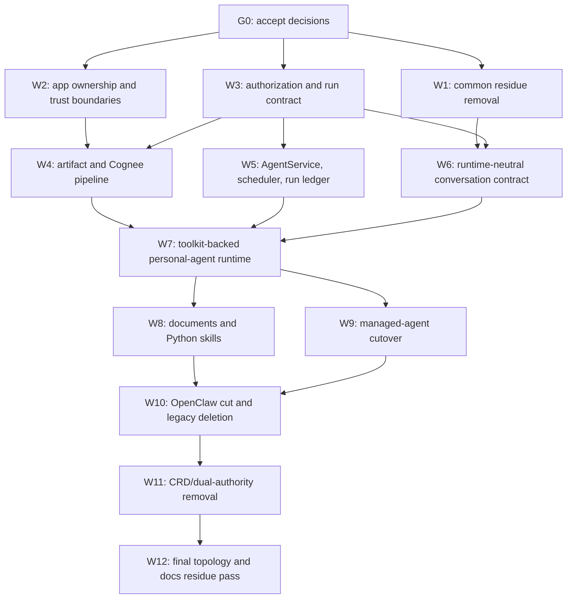

# Personal-agent platform simplification plan

Status: **proposed for review — 2026-07-16.** This plan executes the proposed
[personal-agent platform architecture](personal-agent-platform-architecture.md). It does not make
that proposal an accepted decision.

Delivery alternative: compare this incremental strangler with the
[rewrite-freeze and whole-silo blue/green plan](personal-agent-platform-rewrite-freeze-plan.md).

## Outcome

Deliver one personal-agent platform in which:

- each user has a genuinely personal assistant with durable, inspectable preferences;
- personal and company-managed agents use one runtime, revision, run, scope, and artifact model;
- OpenCrane is the single per-silo management and authorization authority;
- OIDC ingress, Kubernetes workload identity, business authorization, and Cilium enforcement have
  non-overlapping jobs;
- agent services are Deployments or Jobs created from a central registry;
- artifacts live on a per-silo disk and are indexed into Cognee by durable events;
- Obot is the credential/tool execution boundary;
- the OpenCrane UI is the normal console;
- OpenClaw and all compatibility-only state are deleted after a bounded cutover to the
  conformance-selected OpenCrane runtime.

The plan uses a strangler migration, not a rewrite freeze. Common legacy can be removed while the
selected runtime is proven behind the existing `ConversationGateway`. Dual runtime support has an
expiry gate and never becomes a product mode.

## Delivery rules

1. Do not update live issue scopes until Gate 0 accepts the architecture decisions.
2. Every new authority must name the old authority it replaces and the evidence required before
   deletion.
3. New code uses runtime-neutral names. `OpenClaw` appears only in the compatibility adapter.
4. Business intent is written once to Postgres. K8s and Cognee are recoverable projections.
5. Every state migration is expand → backfill → verify → switch reads/writes → delete old path.
6. Every service boundary has authentication, authorization, network policy, audit, health,
   backup/recovery, and upgrade-conformance criteria before production use.
7. A deletion slice includes source, schema, migrations, tests, docs, chart values, env vars,
   dashboards, runbooks, and issue references—not only the primary code.
8. OpenClaw traffic rollback is available only until a canary accepts its first canonical
   new-runtime write. After that frontier, rollback means the previous OpenCrane runtime version or
   an explicit reverse migration. No product feature is implemented twice after canarying begins.

## Dependency map

W1–W3 can run in parallel. W4–W6 can then run in parallel. W7 is the convergence point. W8 and W9
can run concurrently once the same selected runtime has passed personal-agent conformance.

## Gate 0 — accept the architecture before rewriting the backlog

Time box: **one week, 1–2 engineering weeks of effort.**

Decide and record:

- OpenClaw-free OpenCrane-owned end state versus retained OpenClaw;
- Postgres/OpenCrane as authority for silo-owned state, with an explicit fleet-managed membership
  and ClusterTenant lifecycle contract;
- filesystem/PVC as canonical artifact bytes and Cognee as derived index;
- per-silo authorization module plus signed run capabilities;
- ClusterTenant CRD retained; Tenant and AccessPolicy CRDs scheduled for retirement;
- agent controller and channel proxy as separate trust-boundary apps;
- Cilium baseline and Linkerd retirement;
- exact grant deny/priority semantics;
- whether the existing `project` scope remains first-class or has a lossless migration to a named
  team/department relationship;
- isolated execution and publication policy for generated Python;
- the maximum dual-runtime observation window.

Artifacts:

- accepted/superseding ADRs for authority/runtime, artifact/index, and workload identity;
- issue rewrites/successors based on the table below;
- named technical owner for runtime, security owner for capabilities, and product owner for the
  personal-assistant experience;
- a baseline dependency/LOC/manifest inventory so deletion can be measured.

Stop condition: if the organization will not commit to removing OpenClaw, choose the lean OpenClaw
branch explicitly and do not start W7–W10. The common platform work still proceeds, but the expected
steady-state simplification is smaller.

## Runtime branch after Gate 0

The workstreams below describe the recommended OpenClaw-free branch in full. If Gate 0 instead
chooses OpenClaw as the deliberate end state, do not quietly execute half of each branch:

| Workstream | OpenClaw-free branch | Retained lean OpenClaw branch |
|---|---|---|
| W1–W5 | Execute as written | Execute as written; these remove platform duplication and add the authorities OpenClaw does not provide |
| W6 conversation | Postgres owns canonical transcript/events; the selected driver receives a context view | Keep OpenClaw as the explicit runtime transcript/session authority and expose only the product subset through `ConversationGateway`; do not dual-write every event to a competing transcript |
| W7 runtime | Select, build and prove one `AgentLoopDriver` runtime | Replace with a hardening/conformance slice: immutable pinned image, narrow RunContract adapter, disabled channels/cron/devices/memory/config mutation, upgrade suite |
| W8 artifacts/authoring | Governed toolkit tools call isolated document/code Jobs | OpenClaw tools call the same artifact and isolated authoring APIs; no generated Python executes in the OpenClaw pod |
| W9 managed agents | Controller launches the selected image as Deployment/Job | Controller launches/invokes the pinned OpenClaw-backed runtime through one documented adapter; OpenClaw cron remains disabled |
| W10 cutover | Migrate and delete OpenClaw | Skip; explicitly accept the config/protocol/plugin/workspace/transcript compatibility obligations |
| W11–W12 | Execute as written | Execute as written except for code that remains necessary to the retained OpenClaw adapter |

The retained branch is still materially cleaner than today, but it cannot satisfy the “one runtime
state model” part of the proposed architecture. That exception must be documented rather than
hidden behind transcript mirroring or a permanent toolkit feature flag.

## W1 — remove common legacy before either runtime decision

Expected effort: **2–4 engineering weeks.** This work lowers risk in both scenarios.

Deliver:

- remove dead shared-skill directory/symlink scanning and the stale shared-PVC story;
- remove CSV MCP policy parsing and unused Tenant `mcpPolicy`/`channels` fields;
- replace arbitrary runtime `configOverrides` with typed fields or delete unused overrides;
- remove the unused OpenClaw canary/self-update controller and per-tenant runtime-version plumbing;
- make the current OpenClaw bridge an immutable, pinned image—no startup package installation;
- stop all device/pairing side effects and remove BrokeredDevice/legacy pairing/no-op gateway-admin
  state after confirming no consumer remains. Keep `/auth/pod-token` temporarily as the live
  no-token connection/preflight compatibility route until W6 migrates its caller and preserves its
  `NO_TENANT`, `AMBIGUOUS_TENANT`, and `POD_NOT_READY` outcomes;
- remove static `org-shared-secrets` broadcast from agent workloads after scoped provider/MCP paths
  are live;
- delete or reconnect `SessionScope`; the present disconnected CRUD layer is not a security control;
- remove the stale Obot registry-poll NetworkPolicy and documentation;
- freeze new Linkerd dependencies and inventory every remaining live/dormant reference; actual
  removal waits for the Cilium/default-deny replacement gate in W3/W12.

Validation:

- immutable image cold-start and rollback test;
- gateway connection-preflight/login/send/stream/abort/history test, including provisioning and
  missing/ambiguous workspace classification;
- no browser receives a pod or gateway device token;
- effective-contract revocation test;
- rendered Helm contains no removed env vars, volumes, fields, routes, or broad secrets;
- repository-wide forbidden-reference test for every retired name.

Delete gate: none of these paths may remain as “fallback.” A fallback is retained only with a named
expiry, owner, metric, and rollback need.

## W2 — make trust and lifecycle boundaries first-class apps

Expected effort: **3–5 engineering weeks.** Move manifests first without behavior changes, then
narrow privileges.

Deliver app-owned packages:

- `apps/cognee`: image/version, PVC, ServiceAccount, probes, policies, backup, adapters, conformance;
- `apps/obot`: gateway and isolated privileged controller, SA/RBAC/admission/network policies,
  upgrade conformance;
- `apps/channel-proxy`: extracted existing ingress proxy with no K8s mutation, session/JWKS logic,
  or business-policy persistence; it retains delegated OpenCrane resolution;
- `apps/agent-controller`: workload reconciler/scheduler with the only general agent-workload K8s
  mutation role;
- `apps/artifact-service`: initially deployable with health/auth shell; storage behavior lands in W4;
- `apps/agent-runtime`: initially an image/test shell; loop behavior lands in W7.

Narrow `apps/opencrane-infra` to composition. Each app owns its deployment templates and values
contract. The umbrella selects one explicit deployment profile rather than deriving topology from
legacy `sharedPlatform`, `fleetManager`, `multiCt`, `multiInstance`, billing, or seed switches.

Security validation:

- channel proxy cannot list or mutate K8s objects;
- extracted proxy strips public identity headers and delegates cookie/token plus trusted host to
  OpenCrane; expired/revoked/wrong-issuer/wrong-audience/cross-CT/suspended sessions fail closed;
- OpenCrane API cannot create arbitrary agent workloads after controller extraction;
- ordinary runtime has `automountServiceAccountToken: false`, zero K8s RBAC, and only explicitly
  projected audiences;
- Obot callers cannot use its privileged controller identity;
- Cognee has a dedicated KSA and only the expected ingress paths;
- Helm render parity proves no behavior was lost before old templates are deleted.

Delete gate:

- delete the corresponding embedded umbrella templates only after app-owned renders are equivalent;
- delete fleet/shared/billing topology values only after the `standalone | fleet-managed` profile
  covers supported installs;
- delete in-process gateway proxy/controller startup only after the extracted apps pass auth and
  failure tests.

## W3 — establish the authority and signed run contract

Expected effort: **4–6 engineering weeks.**

Deliver:

- `libs/authorization/contracts` with typed principal, resource, action, decision, explanation, and
  capability claims;
- `libs/authorization/engine` behind a stable API, initially using the existing Postgres grant
  compiler and membership state;
- principals for AgentService/Revision/Run/workload and resources/actions for agents, schedules,
  artifacts, memory, skills, MCP, approvals, logs, and publication;
- versioned fleet-membership projection metadata (`sourceVersion`, `lastSyncedAt`, mode) plus a
  documented maximum staleness and fail-closed capability-issuance policy; standalone mode owns the
  same contract locally;
- one documented deny/priority rule and conformance fixtures shared by every PEP;
- a proof-of-possession-bound run context that is usable only to request narrower action
  capabilities, plus action capabilities carrying audience, expiry, `jti`, CT, actor, workload,
  run/revision, resource/action/arguments hash, contract/grant hashes, scope IDs, budgets, and key
  rotation;
- explicit capability classes: repeatable read/stream/upload-lease tokens remain short-lived and
  proof-of-possession-bound; mutating/tool-invocation tokens are one-shot or idempotency-bound and
  their `jti`/result is atomically recorded by the PEP. A nonce claim alone is never treated as
  replay protection;
- online re-check path for high-risk/revocation-sensitive actions;
- namespaced full-KSA parsing and a canonical workload identity registry;
- controller-registered workload assignments binding AgentService/Run/revision to namespace and
  Pod/Job UID; single-use hashed bootstrap grants for Jobs and one-time run challenges for registered
  personal pods, so a pooled KSA cannot request another workload's run context;
- stable workload-profile KSA/application Cilium policy templates for proxy, API, controller, runtime, Obot,
  artifact, and memory paths, with default-deny, required service/port reachability, and L7 rules
  only where protocol visibility supports them;
- Cilium install/preflight and identity observability that do not require SPIRE or encode business
  scopes as network labels;
- audit decision ledger and effective-access explanation endpoint;
- adapter/projection contracts for Obot, Cognee, artifact service, runtime, and proxy.

Do not deploy a new authorization service or datastore in this workstream. Reconsider extraction
only with measured latency/availability or independent-scaling evidence. Evaluate OpenFGA only
behind the interface if the relationship graph outgrows the existing compiler.

Validation:

- table-driven allow/deny tests for org, department, team, personal, and multiple direct users;
- delegated interactive rights can only shrink the agent ceiling;
- scheduled AgentService rights do not inherit the creator's later session;
- child-agent and tool capabilities are monotonic subsets;
- a personal agent may call a managed agent, but the managed AgentService receives no personal
  workspace/thread/memory/filesystem/log access except explicitly shared ArtifactVersions and
  declared inputs;
- cross-ClusterTenant, wrong audience, wrong KSA namespace, expired, wrong proof key, replayed
  one-shot, mismatched-arguments, and stale-revision capabilities fail closed; repeatable token
  classes cannot authorize a mutation;
- fleet outage, stale membership projection, role downgrade, suspension, and offboarding tests prove
  the freshness window and fail-closed capability policy in fleet-managed mode;
- a pod holding the same pooled KSA cannot bootstrap a run assigned to a different Pod UID,
  AgentService, revision, or Job, and a consumed bootstrap cannot be exchanged again;
- a permitted runtime KSA can reach only its named PEPs, and network reachability alone never grants
  an artifact/tool/memory action;
- decision/audit evidence contains no sensitive prompt or secret material.

Delete gate: remove static internal agent tokens and duplicate grant/policy paths only when every PEP
passes the shared conformance suite.

## W4 — canonical artifacts, Cognee indexing, and skill-byte consolidation

Expected effort: **4–7 engineering weeks.**

Deliver:

- Artifact/ArtifactVersion metadata, grants, lineage, retention, and index-status schema;
- content-addressed filesystem layout on a per-silo PVC with atomic commit, quotas, MIME validation,
  malware scan, checksum verification, leases, range reads, and garbage collection;
- an upload lease/stage/promote/finalize protocol in which OpenCrane alone commits visible metadata
  and its outbox, while unreferenced promoted digests are safe for garbage collection;
- transactional digest reference counts or race-safe mark-and-sweep generations, including active
  upload/workspace leases, before physical CAS deletion;
- transactional outbox with idempotent consumers;
- Cognee indexer for publish/share/delete events and deterministic external-ID removal;
- memory gateway so agent workloads do not use per-user Cognee passwords or unrestricted raw APIs;
- backup/restore procedure with a quiesced checkpoint binding the Postgres backup/WAL position to a
  PVC snapshot, followed by hash reconciliation and Cognee rebuild;
- migration of company documents and skill bytes to ArtifactVersions;
- logical Skill/SkillRevision catalog referencing immutable artifact digests.

Validation:

- upload/read/version/share/revoke/delete across every scope type;
- interrupted upload never creates a visible version;
- outbox replay is idempotent and surfaces lag;
- artifact delete removes the Cognee projection and retention eventually purges bytes;
- deleting one ArtifactVersion never removes a digest still referenced or leased by another;
- Cognee can be rebuilt entirely from artifact metadata/events plus canonical bytes;
- a point-in-time restore from a recorded DB/PVC checkpoint preserves hashes, grants, lineage, and
  index recovery; snapshot skew cannot produce metadata that references missing bytes;
- a runtime cannot read the disk or another artifact without the service capability.

Deferred deletion gates—these do **not** block W4 exit or W7. W4 exits when the foundation and the
serving bridge pass the validation above; the following cleanup executes in W7/W10 after its named
consumer gates pass:

- after W7 selects the runtime, verify that both it and the serving OpenClaw bridge consume the
  artifact-backed catalog through tested adapters; then delete `SkillBundle.content`, OCI/DB dual
  write/fallback, and Zot. Defer `apps/feat-skill-registry` deletion to W10 while any OpenClaw
  entrypoint still calls it;
- after the memory gateway is live, route the serving OpenClaw bridge through a compatible adapter
  and prove recall, capture, scope, credential rotation and rollback before deleting per-user Cognee
  credentials, direct tenant-pod ingress or account-repair loops. Otherwise defer those deletions to
  W10. Preserve rollout, participation, policy-violation, and harvesting-checkpoint evidence until
  W5/W7 migrates it with parity;
- keep OCI only as an optional export adapter if a named external consumer requires it.

## W5 — AgentService registry, scheduler/controller, and run ledger

Expected effort: **4–7 engineering weeks.**

Deliver:

- AgentService, immutable AgentRevision, trigger, AgentRun, RunEvent, attempt, checkpoint, approval,
  and deployment-status records;
- personal and managed service kinds using the same revision/contract model;
- an expand/backfill path mapping every existing Tenant to an AgentService while the OpenClaw image
  still runs, with shadow desired-state/status comparison before any writer switch;
- after shadow parity, switch create/update/suspend/resume/delete intent to AgentService/Postgres
  while retaining the Tenant CR only as a bounded rollback projection through the observation gate;
- controller reconciliation from Postgres intent to a personal Deployment, lightweight schedule
  trigger CronJob, or one-attempt runtime Job; a trigger calls an idempotent OpenCrane endpoint and
  never runs the agent itself;
- authenticated internal desired-state/status APIs so the controller consumes the OpenCrane outbox
  without directly writing business-policy tables;
- manual/scheduled trigger, pause/resume schedule, concurrency policy, deadline, retries, backoff,
  cancel, and terminal-state repair. OpenCrane transactionally creates the run/outbox first; the
  controller creates a suspended `backoffLimit: 0` Job, records its UID and one-shot bootstrap, then
  unsuspends it. The first Pod UID is registered before bootstrap exchange and a different Pod under
  that Job is rejected. Every retry creates a new recorded attempt and Job;
- bounded runtime-profile KSAs for ordinary personal/scheduled workloads, dedicated KSAs only for
  distinct cloud-IAM/network needs, and bounded executor pools for short jobs;
- transactional creation of desired run plus outbox command; idempotent K8s reconciliation;
- migration of HarvestingCursor to AgentRun checkpoints and AwarenessRollout/ParticipationEvent/
  TenantParticipation to revision-rollout, RunEvent, audit, liveness, and policy-violation records,
  retaining historical evidence and rollback frontier;
- run status/events API and basic console before migrating production schedules.

Port the Slack-specific `apps/feat-central-agents` behavior as a normal AgentService with schedule,
MCP connector, skill, and checkpoint. Do not preserve its interval loop or direct Cognee writes.

Validation:

- duplicate outbox delivery creates one workload/run attempt;
- a CronJob fire creates one idempotent `AgentRun` before any runtime pod, only the controller-bound
  Pod UID can consume that Job's bootstrap, and a retry uses a new recorded attempt/Job rather than
  a replacement pod under an old bootstrap;
- controller restart and missed watch repair converge correctly;
- overlapping schedules obey concurrency policy;
- pod/job loss produces a deterministic terminal or retry state;
- schedule/share/revision changes take effect only at documented boundaries;
- offboarding and revocation prevent new invocations and terminate or quarantine active ones;
- existing personal agents pass create/update/suspend/resume/delete and rollback tests after
  AgentService/Postgres becomes the writer while their runtime is still OpenClaw-backed;
- migrated rollout frontier, liveness/version-drift, skill-execution, policy-violation, and
  harvesting checkpoints match the legacy records before those tables are retired;
- controller is the only OpenCrane agent-workload K8s mutator; the separately confined Obot
  controller can mutate only approved MCP-server objects in its own runtime namespace.

Delete gate: delete `apps/feat-central-agents`, its Slack polling schema/config, and custom timer loop
after equivalent scheduled runs produce the same approved artifacts/memory updates for an
observation window.

Delete the legacy awareness rollout/participation/checkpoint tables only after all producers and
consumers use the migrated W5 records, the historical counts/frontier reconcile, rollback is proven,
and an observation window shows equivalent liveness, drift, execution, and violation signals.

## W6 — own the small conversation and runtime contract

Expected effort: **3–5 engineering weeks.**

Deliver:

- canonical Thread/Message/RunEvent APIs and storage;
- runtime-neutral event types for text, tool, approval, artifact, usage, status, error, and terminal;
- cursor-paged history and stream reconnect/backfill;
- message idempotency, one-active-run policy or explicit branching, abort, and terminal reconciliation;
- artifact references for multimodal messages;
- a runtime-neutral connection/preflight endpoint preserving current provisioning and tenant-error
  classifications, followed by frontend migration away from `/auth/pod-token`;
- a server adapter behind the existing frontend `ConversationGateway`;
- an OpenClaw compatibility adapter that maps only the required product subset during migration.

Validation:

- contract tests run against the OpenClaw bridge plus golden fixtures/reference driver in W6; W7
  adds the selected toolkit adapter to the same suite before canarying;
- reconnect cannot lose or duplicate committed user-visible events;
- abort during model stream and tool execution reaches a terminal state;
- runtime crash after a side effect cannot silently replay it;
- history, scope, authorization, and retention are enforced by the canonical API;
- no OpenClaw admin/config/channel/cron/node/device method leaks into the product contract.

Delete gate: the frontend imports only runtime-neutral contracts and uses the replacement preflight
before the selected-runtime canary begins; only then delete `/auth/pod-token` and its compatibility
types/tests.

## W7 — toolkit-backed personal-agent runtime and conformance gate

Expected effort: **7–11 engineering weeks.** This is the runtime go/no-go workstream.

Execute the two-adapter bake-off and reliability-envelope plan in the
[OpenClaw loop investigation](openclaw-agent-loop-replacement-plan.md), then build one pinned
TypeScript runtime. The OpenAI Agents SDK JS `Agent`/`Runner` path is the leading candidate; AI SDK
`ToolLoopAgent` is the control and fallback:

- the selected provider adapter targets the per-silo LiteLLM OpenAI-compatible proxy with a scoped
  virtual key;
- an explicit OpenCrane context projection, plus a toolkit-specific session adapter only when the
  selected driver requires it, receives context while Postgres remains transcript authority;
- stream adapter emits the W6 protocol and persists ordered events;
- the selected adapter passes the W6 contract suite before it can serve a canary;
- direct streamable-HTTP MCP adapter uses Obot capabilities;
- pre-run Cognee recall and post-run memory capture use the memory gateway;
- deterministic persona compiler assembles platform, company, personal, memory, and thread layers;
- turn, token, cost, deadline, tool, and child-agent budgets fail closed;
- approval pause/resume, cancellation, crash recovery, idempotency, and provider-neutral compaction;
- custom OTEL processor with any toolkit default external trace export disabled;
- exact toolkit/LiteLLM/provider pins and an upgrade-conformance suite.

The personal-assistant product gate covers:

- selected voice/persona persists across threads and runtime restart;
- explicit preferences are remembered, explainable, correctable, and forgettable;
- inferred preferences follow the configured consent/sensitivity policy;
- specialist tools return through the personal assistant's final voice;
- personal memory cannot leak into a managed/company agent or another user;
- retrieved memories, documents, and MCP output cannot modify prompt authority or grant tools;
- the user can inspect the effective model, tools, skills, memory scope, and sharing.

Runtime parity gate:

- history, stream/reconnect, cancellation, tool calls, MCP approval, attachments, compaction, cost,
  rate limits, revoke/cut, idle scale-to-zero, restart, and provider failover;
- fault injection for model timeout, Obot/Cognee/artifact outage, pod eviction, duplicate request, and
  partial tool side effect;
- security tests for cross-CT/user/thread/artifact/tool access and capability replay;
- load tests for the expected personal-agent concurrency and event backlog.

Go/no-go rule: do not proceed to W10 if session correctness, cancellation/recovery, authorization,
or required LiteLLM provider behavior is weaker than the OpenClaw baseline. Fix the selected owned
runtime, apply the documented toolkit fallback rule, or deliberately retain lean OpenClaw; do not
ship an indefinite dual-runtime toggle.

## W8 — multimodal documents and governed Python skills

Expected effort: **5–9 engineering weeks.** Can run in parallel with W9.

Deliver:

- upload/preprocess pipeline for images, PDF, audio, video derivatives, and office documents;
- model capability routing and deterministic fallback extraction;
- isolated document-authoring Job profiles with render/validate/preview/new-version workflow;
- skill candidate bundle with `SKILL.md`, Python, tests, declared dependencies/MCP/network needs,
  provenance, and semantic version;
- isolated authoring/test Job, dependency allowlist, formatting/types/tests, license/secret/malware
  scans, diff/review, signing, publication, revocation, and rollback;
- trust classes for image-baked platform tools, declarative skills, and isolated tenant code tools;
- console flow from personal conversation → draft asset/skill → evidence → approval → publish/share.

Validation:

- no unpublished Python executes in the personal runtime;
- authoring Jobs have no production MCP credentials and default-deny egress;
- signed digest is the exact digest executed;
- revocation blocks new calls without corrupting historical runs;
- representative DOCX/PDF/slide/sheet outputs are rendered and visually verified;
- malformed, oversized, malicious, or unsupported media fails safely;
- every output is a governed ArtifactVersion with lineage and share policy.

## W9 — managed agents, scopes, schedules, and consoles

Expected effort: **4–7 engineering weeks.**

Deliver:

- publish/share managed agents to organization, department, team, personal, or explicit users;
- run-as-AgentService semantics for schedules and delegated-user semantics for interactive calls;
- agent catalog, revision diff/publish/rollback, schedule, live run, approval, asset, access explorer,
  and security/operations console views;
- notifications for failed schedules, pending/expired approvals, revoked skills, budget thresholds,
  and Cognee indexing lag;
- API-first automation path and a decision on each remaining `oc` command;
- runbooks for pause, revoke, replay-safe retry, provider outage, backup/restore, and runtime rollback.

Validation:

- scope matrix proves discover/read/trigger/revise/admin separation;
- a direct share to several people does not create a new team or K8s identity;
- scheduled runs retain only AgentService rights and current revision/grant hashes;
- UI and automation call the same API and show the same effective access/status;
- every operational action has an audit record and a safe rollback path.

Pre-W10 authority gate: every existing personal and managed workload is created and controlled from
AgentService/Postgres, AccessPolicy intent has a typed OpenCrane equivalent, and Tenant/AccessPolicy
CRs are read-only rollback projections. The current OpenClaw runtime must still be available while
this writer cutover is verified; runtime replacement cannot mask an authority-migration failure.

## W10 — cut OpenClaw and remove its compatibility surface

Expected effort: **3–6 engineering weeks** plus an agreed observation window.

Precondition: the W5/W9 authority gate has switched and verified existing workloads before any
OpenClaw runtime cut. Stop here if Tenant or AccessPolicy CRs remain the desired-state writer.

Cutover sequence:

1. select internal canary users and duplicate no side effects;
2. migrate read-only history/persona/artifact references;
3. quiesce a canary, record its write frontier, capture the OpenClaw store, and prove whole-agent
   rollback before allowing the selected runtime to write;
4. run the selected runtime as primary. Once it accepts the first canonical write, close OpenClaw
   traffic rollback for that canary; subsequent rollback uses the previous OpenCrane runtime image
   against the same canonical state unless an explicit reverse migration is approved;
5. widen by complete ClusterTenant/user cohorts after conformance/SLO review;
6. stop creating OpenClaw personal workloads;
7. retain the OpenClaw image/data as a read-only archive for the fixed observation window, not as a
   runnable rollback target after the write frontier;
8. remove the compatibility adapter and migrate/expire remaining transcript data;
9. delete all OpenClaw-only code and controls in one residue-tracked program.

Delete:

- `apps/feat-openclaw-tenant`;
- startup installer, ConfigMap renderer/schema, metadata workarounds, runtime updater/version fields;
- gateway-v4 schema/client/event folding and OpenClaw renderer/A2UI shims;
- workspace persona/marker compatibility and Cognee plugin/account lifecycle;
- OpenClaw names, routes, env vars, chart values, tests, docs, dashboards, alerts, and issue language.

Exit criteria:

- no production workload/image/config references OpenClaw;
- no frontend or API contract imports OpenClaw protocol types;
- no canonical state is readable only through OpenClaw;
- rollback window has expired with accepted SLO/security evidence;
- CI fails on forbidden OpenClaw compatibility references outside archived migrations/history.

## W11 — physically retire legacy CRDs and dual-authority code

Expected effort: **3–5 engineering weeks.** Business-writer migration completed before W10; this
workstream removes the read-only rollback projection only after the runtime observation window.

Deliver:

- verify Postgres desired state/outbox remains the only writer path for personal/managed intent;
- retain status projection, missed-command repair, and deletion/retention behavior already proven in
  W5, then remove their legacy Tenant/AccessPolicy equivalents;
- archive the final Tenant/AccessPolicy rollback projection and migration evidence;
- ClusterTenant CRD retained solely as the fleet↔silo lifecycle contract.

Validation:

- create/update/suspend/resume/delete recover across API, DB, controller, and K8s restarts;
- no double creation or lost deletion when the read-only CR projection is removed;
- drift repair converges from Postgres without accepting unauthorized K8s edits as business intent;
- volume retention and final purge behavior is proven;
- backup/restore and cluster rebuild recreate execution state from business state.

Delete gate:

- remove Tenant and AccessPolicy CRDs, dual-write clients, appearance waits, projection repairers,
  drift endpoints/metrics, and CRD-specific tests only after all supported installs are migrated;
- do not introduce Schedule, MCP, Skill, or Agent CRDs as replacements.

## W12 — final topology, issue, and documentation residue pass

Expected effort: **2–4 engineering weeks.**

Deliver:

- remove moved fleet code/values, billing/shared modes, implicit topology flags, old K8s stems, stale
  container packages, Linkerd, obsolete NetworkPolicies, and legacy environment variables;
- collapse duplicate MCP/grant/skill/persona/awareness models and migrations after data verification;
- update AGENTS/docs/website/operator runbooks, architecture diagrams, OpenAPI, examples, and Helm
  schema to the actual app topology;
- close or replace every superseded GitHub issue and remove folded references;
- add repository checks for retired app names, config keys, CRDs, auth paths, and fallback behavior;
- update README and CHANGELOG only when the capability is actually shipped.

Exit criteria: a new operator can find one documented path to create, share, schedule, observe,
revoke, and delete an agent or asset, and one source explains each authorization decision.

## Live GitHub issue disposition

Verified against the open repository backlog on **2026-07-16**. These are proposed actions after
Gate 0, not issue mutations performed by this document.

| Issue | Proposed disposition | Architecture correction |
|---|---|---|
| [#117](https://github.com/italanta/opencrane/issues/117) | **Rewrite/split** | Make Cilium label/KSA identity the baseline, remove Linkerd, and treat SPIRE/SVID as optional later work rather than equivalent to Cilium identity |
| [#127](https://github.com/italanta/opencrane/issues/127) | **Keep, narrow** | Finish mandatory default-deny/domaining/encrypted storage; avoid baking dynamic business grants into Cilium/AccessPolicy CRDs |
| [#128](https://github.com/italanta/opencrane/issues/128) | **Keep, reframe** | Obot lifecycle and credentials remain; replace “OpenClaw activation” with capability validation and runtime-neutral MCP assignment |
| [#129](https://github.com/italanta/opencrane/issues/129) | **Promote to core epic** | AgentService/Revision/Run, schedules, scopes, controller, managed execution, Slack-worker migration, and the one-way rule that managed agents cannot inspect personal state |
| [#133](https://github.com/italanta/opencrane/issues/133) | **Supersede/close after Gate 0** | Do not complete a Zot-only cutover if skills move to the artifact CAS; retain OCI only as an optional export adapter |
| [#135](https://github.com/italanta/opencrane/issues/135) | **Keep, unblock/reframe** | Remove broad secret broadcast through scoped LiteLLM/Obot/run capabilities; the selected runtime removes the OpenClaw translator blocker |
| [#136](https://github.com/italanta/opencrane/issues/136) | **Keep deferred, split when scheduled** | Dedicated compute and scale-to-zero use AgentService deployment profiles; guardrails join RunEvent/policy, not another runtime |
| [#150](https://github.com/italanta/opencrane/issues/150) | **Close after branch merge and residue gate** | Its completion gates deletion of all fleet-owned values/code/docs from this repo |
| [#154](https://github.com/italanta/opencrane/issues/154) | **Replace** | Define a small app/module contract from Cognee, Obot, artifact, and runtime needs; do not build a generic backend/frontend/chart/migration plugin framework first |
| [#162](https://github.com/italanta/opencrane/issues/162) | **Keep** | OpenCrane UI is the management console; finish chart-native rollout before relying on it for cutover |
| [#174](https://github.com/italanta/opencrane/issues/174) | **Keep, prioritize** | LiteLLM team/key provisioning and reconcile backoff are prerequisites for scoped runtime model access |
| [#216](https://github.com/italanta/opencrane/issues/216) | **Decide in W9** | Remove duplicate CLI business logic; retain only proven bootstrap/automation/break-glass commands using the generated API client |
| [#220](https://github.com/italanta/opencrane/issues/220) | **Split by runtime decision** | Apply least-privilege baseline to the lean bridge; move lasting sandbox/tool policy to runtime/skill-authoring work and close OpenClaw-specific scope at W10 |
| [#221](https://github.com/italanta/opencrane/issues/221) | **Keep and generalize** | Canonical identity must include namespace and full KSA; turn the regression into shared workload-identity conformance |
| [#222](https://github.com/italanta/opencrane/issues/222) | **Keep; align to W4/W8** | Skill versions are artifact-backed, scanned, signed, scope-aware, revocable, and Python code runs in isolated Jobs |
| [#224](https://github.com/italanta/opencrane/issues/224) | **Keep** | Model/cost UI remains; wire it to AgentRevision budgets and LiteLLM policy |
| [#225](https://github.com/italanta/opencrane/issues/225) | **Rewrite/split** | Keep generic workspace/rendering/security work; isolate OpenClaw gateway/A2UI work as temporary bridge scope with an expiry |
| [#226](https://github.com/italanta/opencrane/issues/226) | **Keep** | Membership UI is necessary for subject/grant administration and effective-access explanations |
| [#227](https://github.com/italanta/opencrane/issues/227) | **Keep as cleanup gate** | Delete stale images after renames and OpenClaw cutover, not before rollback windows expire |
| [#231](https://github.com/italanta/opencrane/issues/231) | **Keep, broaden naming pass** | Rename to runtime-neutral service/controller stems and avoid another temporary name that implies the old CRD model |

The root `plan.md` also references closed issues `#130`, `#138`, `#141`, and `#131`, while it omits
many of the live issues above. Rebase the root execution index only after Gate 0 so the accepted
architecture—not this proposal—determines sequencing.

## Planning estimate and maintenance impact

These are engineering-effort ranges, not calendar commitments. They assume reuse of the current
proxy, tenant workload builders, grants, LiteLLM, Cognee, Obot, observability, and UI foundations.
The conformance spike should replace ranges with measured estimates.

| Scope | Incremental effort | What it buys |
|---|---:|---|
| Gate 0 + common cleanup | 3–6 eng-weeks | Removes known residue and prevents more dual-state design |
| App boundaries + authorization | 7–11 eng-weeks | Clear privileges, one policy model, reusable run capabilities |
| Artifacts/Cognee + AgentService scheduler | 8–14 eng-weeks | Required in both runtime scenarios |
| Runtime-neutral conversation contract | 3–5 eng-weeks | Safe strangler seam and canonical history/events |
| Lean OpenClaw hardening beyond common work | 3–6 eng-weeks | Lowest-risk retained-runtime outcome |
| Toolkit-backed personal runtime and migration | 10–17 eng-weeks | Owned loop, session/event behavior, MCP/memory, cutover |
| Documents, multimodal, Python skills, full consoles | 8–14 eng-weeks | Complete requested product/asset workflow |
| CRD/topology/final residue removal | 6–10 eng-weeks | Real single-authority steady state |

Two realistic totals:

- **Lean OpenClaw target:** roughly **24–38 engineering weeks** for the common platform, governed
  assets/scheduling/consoles, and OpenClaw hardening. It reaches production sooner because loop and
  session behavior remain upstream, but it retains the compatibility tax.
- **OpenClaw-free target:** roughly **34–54 engineering weeks** including owned runtime behavior,
  migration, and full deletion. With three focused engineers and parallel workstreams, plan around
  **four to six calendar months** before final residue removal, subject to the W7 conformance gate.

This does not mean the selected loop itself takes that long; the loop is the small part. Reliable
transcripts, recovery, artifacts, authorization, skill isolation, migrations, and consoles dominate.

Recurring maintenance differs:

| Retained OpenClaw | OpenClaw-free |
|---|---|
| Upgrade-test OpenClaw image, gateway protocol, config schema, Cognee plugin, workspace conventions, renderer, transcript/compaction, and OpenCrane adapters | Upgrade-test the exact-pinned selected toolkit, LiteLLM/provider behavior, driver adapter, and OpenCrane-owned runtime services |
| Less first-party loop/session code | More first-party correctness/on-call ownership |
| Continuing mismatch with custom memory/MCP/skills/scheduling | Fewer translations and one personal/managed runtime model |
| Upstream feature breadth remains even when disabled | Smaller dependency surface but OpenCrane must deliberately implement needed behavior |

The owned-runtime route is therefore a **short-term cost increase and a long-term cognitive/authority
simplification**, not an immediate reduction in engineering. The lean OpenClaw route is a delivery
simplification but not a full architectural simplification.

## Review checklist

Architecture reviewers should answer these explicitly:

- Is an OpenClaw-free runtime accepted, or is lean OpenClaw the deliberate end state?
- Does any proposed component introduce a second source of business truth?
- Are the channel proxy and agent controller the right two physical security extractions?
- Can artifact PVC snapshots and Postgres metadata be restored consistently on the selected K8s
  storage provider?
- Does the principal/resource/action model cover direct sharing without encoding business scope in
  Kubernetes?
- Are scheduled services principals in their own right, with current grants and immutable revisions?
- Is every generated-code execution path isolated, reviewable, signed, and revocable?
- Can the owned runtime prove history, reconnect, abort, recovery, compaction, and side-effect
  idempotency before OpenClaw is removed?
- Does every legacy deletion have a migration, verification, rollback, and forbidden-reference gate?
- Can an operator manage the platform through one UI/API without visiting upstream app consoles for
  ordinary work?

## Definition of complete

The simplification is complete only when all of the following are true:

- one API/database owns agents, revisions, schedules, scopes, persona, artifacts, skills, and runs;
- one runtime contract serves personal and managed agents;
- only the agent controller mutates agent workloads;
- every runtime has zero K8s API permissions and receives only short-lived scoped capabilities;
- correct OIDC membership and business authorization are required before any channel reaches an
  agent;
- artifact bytes have one canonical location and Cognee is reproducible downstream state;
- the personal assistant remembers transparently and remains the final voice into company assets;
- generated Python cannot execute before isolation, tests, scan, review, and publication;
- OpenClaw, Zot/core OCI, Tenant/AccessPolicy CRDs, Linkerd, pairing/device, broad secret broadcast,
  dual writes, fallback paths, and stale app/topology flags are absent;
- UI, API, operational telemetry, and audit tell the same run/access story;
- CI prevents retired concepts from returning.
