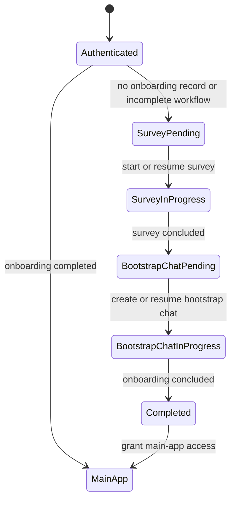

# Identity and onboarding user stories

## Feature intent

Bring a person from an anonymous browser to a truthful, authority-bound starting point. Identity,
organisation, and role come from the server session; the browser never chooses its own silo.

Current status: `API partial` and `UI implemented` through the guided first conversation.
Server-tracked survey routing, persona orchestration, the pinned onboarding-only exchange, and its
server-validated conclusion are implemented. The main-app API fence and personal workspace/runtime
provisioning remain `API blocked`.

## Product workflow — server-tracked onboarding

Onboarding is a resumable server-owned workflow. Authentication establishes identity; a separate
`UserOnboarding` authority decides the first product route and whether main-app capabilities are
available. Browser storage is never the onboarding source of truth.

Canonical onboarding states:

- `survey_pending`
- `survey_in_progress`
- `bootstrap_chat_pending`
- `bootstrap_chat_in_progress`
- `completed`

Initial routing is deterministic:

| Session and onboarding state | Initial route |
|---|---|
| No authenticated session | `/login` |
| `survey_pending` or `survey_in_progress` | `/onboarding` |
| `bootstrap_chat_pending` or `bootstrap_chat_in_progress` | `/onboarding/chat` |
| `completed` | Main application |
| Onboarding authority unavailable or invalid | Blocking recovery state; never optimistic main-app access |

The workflow record is keyed by server-derived silo and stable OIDC identity. It records the
workflow version, current state, completion provenance, started/updated/completed timestamps, and,
when applicable, the exact persona interview/revision and bootstrap conversation references. A
started bootstrap chat pins an immutable, retrievable `bootstrap.md` content revision plus its digest
for integrity verification; a digest alone is insufficient because it cannot restore replaced
content. The workflow record does not duplicate persona answers, transcript content, credentials,
or runtime proofs.

Failures do not become alternative lifecycle states. The user remains at the last durable state and
can retry or resume it after refresh, logout, or device change. A changed workflow or `bootstrap.md`
does not silently alter an in-progress onboarding: the started workflow stays pinned to its recorded
version. Existing users require an explicit completed-state seed or migration so absence is not
mistaken for either completion or safe main-app access. Migrated completion uses provenance
`existing_user_migration`, with a migration revision/batch and timestamp; it never fabricates a
persona revision, bootstrap conversation, or conclusion. Ordinary completion uses provenance
`bootstrap_concluded` and requires the exact bootstrap evidence described below.

The frontend route guard is a convenience, not the authority fence. Main-app APIs must also deny an
authenticated user whose onboarding is not `completed`, while authentication and the exact
onboarding endpoints remain reachable.

## IDO-01 — Sign in through the configured identity provider

**As an** invited or eligible user, **I want** to sign in through my organisation's identity
provider **so that** OpenCrane can use my verified identity and current authority.

Acceptance criteria:

- An anonymous visitor can start sign-in and return to a sanitized in-product destination.
- Loading, identity-provider unavailable, access denied, expired state, and callback failure are
  distinct states.
- The failure surface distinguishes ineligible user, unknown identity, expired login, provider
  refusal, and configuration unavailable using stable server outcomes and safe recovery actions.
- The browser never displays or stores OIDC client secrets, session secrets, PKCE verifiers, or
  raw tokens.
- A failed configured allowlist or first-owner admission does not leave a misleading signed-in UI.

API: `GET /api/v1/auth/me`, `GET /api/v1/auth/login`, `GET /api/v1/auth/callback`.

## IDO-02 — Understand my active identity and authority

**As a** signed-in user, **I want** to see which identity, organisation, and role are active **so
that** I understand what I can access and administer.

Acceptance criteria:

- The UI uses the server-projected name, email, picture, ClusterTenant, groups, owned organisations,
  `isOrgAdmin`, and `isPlatformOperator` values.
- Missing role configuration resolves to ordinary-user capability, not optimistic admin access.
- Host/silo mismatch or lost membership produces a bounded no-access state without leaking another
  silo's existence.

Design states: loading, signed out, signed in, no active organisation, ordinary member, organisation
admin, platform operator, and session error.

API: `GET /api/v1/auth/me`.

## IDO-03 — Claim the first standalone Owner slot

**As the** configured bootstrap owner, **I want** my first verified login to claim the standalone
Owner membership **so that** a clean silo has one accountable administrator.

Acceptance criteria:

- Admission requires the configured host tenant, issuer, stable subject, and verified bootstrap
  email.
- The UI handles `admitted`, `already_owner`, `not_eligible`, and `already_claimed` without implying
  that email itself is the durable identity.
- Membership creation and its audit record appear as one completed outcome.
- Non-eligible and already-claimed outcomes direct the user to an explicit recovery path.

API: part of the OIDC callback handshake; no browser-supplied owner-claim payload.

## IDO-04 — Sign out safely

**As a** signed-in user, **I want** to sign out locally and, when supported, at the identity provider
**so that** another person cannot continue my session.

Acceptance criteria:

- Local session state is cleared before the browser presents a signed-out state.
- The UI follows the returned identity-provider end-session URL only when supplied.
- Sign-out failure does not preserve a visually authenticated shell.

API: `POST /api/v1/auth/logout`.

## IDO-05 — Route from durable onboarding state

**As a** newly authenticated user, **I want** OpenCrane to route me from my durable onboarding state
**so that** I continue the required step or enter the main application without repeating work.

Acceptance criteria:

- Completion is not defined by local or session storage.
- No onboarding record starts the current onboarding workflow; a compatible `completed` record
  enters the main application.
- The journey derives its next step from session authority, persona status, personal-agent
  availability, and workspace/thread readiness.
- The onboarding sequence is: Sign in → Claim ownership → **Sorting quiz** → Review persona draft →
  Approve persona → Bootstrap first conversation → Workspace ready.
- The sorting quiz (PER-02) is a mandatory onboarding step. A personal agent cannot be provisioned
  without an approved persona revision produced through the quiz.
- Survey states route only to `/onboarding`; bootstrap-chat states route only to
  `/onboarding/chat`; `completed` routes to the main application.
- Refreshing or changing device resumes the same server-known position, including mid-quiz state.
- Onboarding-state lookup failure renders a blocking recovery state rather than granting access or
  restarting the workflow.
- The current `Welcome → Workspace → Personalize → Tour → Finish` local-only loop is not retained as
  product authority.

Status: `API partial`. The `UserOnboarding` record, public route-state projection, and exact
persona-survey orchestration exist. The bootstrap-chat authority, main-app API fence, and personal
workspace/AgentService provisioning remain blocked.

> See also: [persona sorting quiz](../design/persona-sorting-quiz.md),
> [persona user stories](persona.md)

## IDO-06 — Start registration intentionally

**As a** new eligible user, **I want** a registration action that the identity provider understands
**so that** “Create account” is not merely another sign-in button.

Acceptance criteria:

- The backend explicitly accepts, validates, and forwards the intended registration prompt, or the
  UI removes the separate registration claim.
- Unsupported provider registration is explained before redirect.

Status: `API partial`. The frontend currently sends `prompt=create`, but the backend ignores it.

## IDO-07 — Complete the onboarding survey

**As a** new user, **I want** to complete and resume the onboarding survey **so that** OpenCrane has
reviewed evidence about how my personal agent should work with me.

Acceptance criteria:

- The current product workflow uses the governed persona interview as the survey authority rather
  than copying answers into `UserOnboarding`.
- Starting the survey durably moves onboarding from `survey_pending` to `survey_in_progress`.
- Choosing “sort again” while the initial survey is still in progress CAS-replaces only the exact
  pinned interview; after persona approval, later persona refreshes never regress onboarding.
- The onboarding authority verifies the exact completed and approved persona revision before moving
  to `bootstrap_chat_pending`; the browser cannot assert survey completion.
- Refresh, logout, duplicate start, validation failure, and unavailable question-set states resume
  or remain at the last durable state.
- Survey completion never grants main-app access directly.

APIs: the persona interview lifecycle plus a new server-owned onboarding transition/projection.

Status: `API implemented`. Persona start and exact approved revisions advance the
server-owned `UserOnboarding` record without copying persona evidence. Bootstrap provisioning remains
outside this survey capability.

## IDO-08 — Complete the pinned bootstrap chat

**As a** surveyed new user, **I want** to complete a guided onboarding conversation based on
`bootstrap.md` **so that** I understand the agent relationship and establish the remaining personal
workspace context before entering the product.

Acceptance criteria:

- Entering `bootstrap_chat_pending` creates or resolves one onboarding-only conversation and the
  personal agent/workspace authority it requires.
- Starting the chat pins an immutable, retrievable `bootstrap.md` content revision and its integrity
  digest, then moves the state to `bootstrap_chat_in_progress`.
- Refresh, logout, another device, or a retry resumes the same authoritative conversation.
- The bootstrap chat remains available before main-app access without exposing ordinary workspace
  routes or APIs.
- Concluding requires a server-validated workflow outcome; a client flag or model-authored claim
  alone cannot mark onboarding complete.
- A failed or interrupted chat remains resumable and never sends the user back to the survey.

Status: `API partial`, `UI implemented`. The server selects one of four reviewed `bootstrap.md`
sources from the exact approved persona, pins its revision and digest, resumes one onboarding-owned
conversation, records three append-only idempotent answers, and validates conclusion. This bounded
exchange deliberately does not provision ordinary personal workspace, AgentService, membership,
model runtime, or live-stream authority; those remain blocked.

## IDO-09 — Enter the main application only after conclusion

**As a** user who concluded onboarding, **I want** durable access to the main application **so that**
future logins bypass onboarding while incomplete users remain inside the workflow.

Acceptance criteria:

- For ordinary onboarding, the server atomically records `completed`, workflow version,
  `completionProvenance=bootstrap_concluded`, and `completedAt` only after the bootstrap-chat
  conclusion is valid.
- The next route is the main application, and subsequent authenticated sessions route there directly.
- Main-app APIs reject authenticated but incomplete users independently of Angular routing.
- Authentication, survey, bootstrap-chat, logout, and recovery endpoints remain reachable during
  onboarding.
- Existing users are explicitly seeded or migrated to `completed` with
  `completionProvenance=existing_user_migration`, the migration revision/batch, and `completedAt`.
  Migration never fabricates bootstrap or persona evidence, and missing state never implicitly means
  completed.

Status: `API partial`, `UI implemented`. The bootstrap authority atomically records
`bootstrap_concluded` only after the exact pinned three-answer exchange is valid, and later route
reads resume the completed state. The independent main-app API fence is still blocked, so this does
not yet satisfy the complete access-control story.
