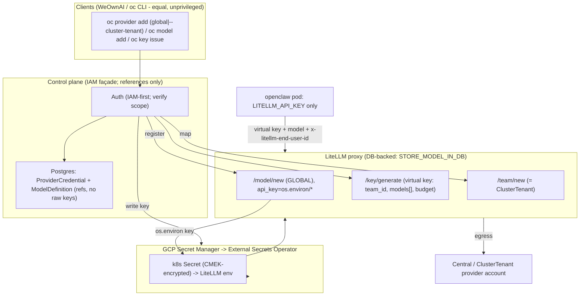

# Maximizing LiteLLM for OpenRouter-Style BYOK + BYOM on OpenCrane

*Decision-ready architecture report — replacing the orphaned `ProviderApiKey` table and the `org-shared-secrets` broadcast with a control-plane/cluster-scoped, DB-backed model registry, while keeping provider credentials central and per-tenant identity on LiteLLM virtual keys.*

---

## 0. Status & locked decisions (2026-06-18)

These were settled in discussion and supersede any inline text that predates them:

1. **Full AGPL, forever.** OpenRouter is **UI/CLI inspiration only** — we borrow the concepts (unified model catalog, per-key budgets, model-in-request), **not** the wire format. No OpenRouter client-slug/`provider`-object compatibility layer. Triangulate the surface with the WeOwnAI frontend, not openrouter.ai.
2. **No fee — meter and manage only.** Drop the 5% BYOK fee / prepaid-credit wallet entirely. Budgets are pure cost controls; spend is reporting. 100% of any routing savings flow to the customer's / our provider bill.
3. **No LiteLLM Enterprise license.** Enterprise code is proprietary and cannot ship in a distributed AGPL artifact regardless; the OSS workarounds below are therefore *permanent architecture*, not stopgaps.
4. **BYOK is at the control-plane / ClusterTenant level — never per-openclaw-tenant.** There are **two distinct key types** and only one is per-tenant:
   - **Upstream provider key** (OpenAI/Anthropic/…): **central** (platform default) or **per-ClusterTenant** (a customer's own account, optional). Held by LiteLLM; tenants never see it.
   - **LiteLLM virtual key**: **per-openclaw-tenant**, minted by LiteLLM, carries budget + model allowlist + identity. The tenant calls LiteLLM with it and names the model in the request. *(Already built — `tenant-litellm-keys.ts`.)*
5. **Secrets are k8s-native.** Provider keys ride the existing **GCP Secret Manager → External Secrets Operator (Workload Identity) → k8s Secret** pipeline (`external-secrets-store.yaml`, `external-secrets.yaml`). The "secret-manager backends are Enterprise" caveat was **narrower than first stated** — it refers only to LiteLLM *natively* reading from Vault/GCP-SM at runtime, which we don't need because we use ESO. **GKE application-layer Secrets encryption with Cloud KMS (CMEK) must be ON by default** (currently a Terraform gap — see §7).

Net effect on this report: the per-tenant `ProviderCredential` is gone; provider credentials are global/ClusterTenant-scoped; the LiteLLM `/credentials` DB store is now **optional** (only for *dynamic* cluster-level BYOK), with **ESO→k8s-Secret→env** as the k8s-native baseline. The single biggest unlock is still **DB-backed LiteLLM for BYOM model registration** (`STORE_MODEL_IN_DB`).

---

## 1. TL;DR

- **The whole desired feature set is achievable on MIT/OSS LiteLLM.** Virtual keys, Teams, Customers/End-users, budgets (global/team/key/customer + tag), RPM/TPM limits, DB-backed runtime model registration (`/model/new`), wildcard/passthrough routing, custom pricing, and model-group access control are **all OSS** — verified against LiteLLM source and docs.
- **Biggest single unlock: `STORE_MODEL_IN_DB=True` + a Postgres `DATABASE_URL` for LiteLLM** — this is what lets the control plane register models at runtime (BYOM) without a redeploy. Today only the `gcp.yaml` overlay wires a DB (`platform/helm/values/gcp.yaml`); the default and *all* k3d profiles run LiteLLM DB-less, so `/model/new` is impossible.
- **Provider credentials stay central / per-ClusterTenant and k8s-native.** Models reference `os.environ/<KEY>`; the key arrives via ESO (GCP-SM) → k8s Secret → LiteLLM env. Central provider keys change rarely, so restart-on-change is fine — **no LiteLLM credential DB store required for the baseline.** The `/credentials` API is reserved for the *optional, dynamic* case (a ClusterTenant adds its own provider account without a restart).
- **Per-tenant identity = the LiteLLM virtual key (already built).** Extend it with `team_id` (= ClusterTenant), a `models[]` allowlist, `budget_duration`, and rate limits — today it sends only 3 params and is never rotated.
- **Map `ClusterTenant` → LiteLLM Team; openclaw `Tenant` → virtual key; end-user → Customer.** Use **Teams, not Organizations** (Organizations are Enterprise; Teams are OSS and the endorsed boundary).
- **Two correctness landmines (verified):** (1) a client can self-declare the `user` field, so OpenCrane MUST inject `x-litellm-end-user-id` server-side; (2) LiteLLM does **not** reliably enforce the team⊆/key⊆ model-subset invariant — OpenCrane must enforce each virtual key's `models[]` ceiling itself, and **never leave `models[]` empty** (empty = ALL models).
- **Security prerequisite before any of this ships:** dev auth is OPEN and there's no per-route RBAC — the credential/model mutation routes need ClusterTenant-scoped authorization at the route layer (§7).
- **First experiment is not BYOK at all — it's the shadow-mode routing measurement** (see the companion router report): measure what model-routing *would* save, at zero production risk, before building anything.

---

## 2. Where OpenCrane is today

OpenCrane has **two disconnected credential paths** and **no model dimension at all**. Three layers.

### Layer 1 — Global provider keys → `org-shared-secrets` broadcast (the working path)

- The control plane exposes flat CRUD over a single install-global `ProviderApiKey` table: `GET /providers/keys`, `PUT/DELETE /providers/keys/{provider}` (`apps/clustertenant-platform/src/routes/provider-keys.ts`; OpenAPI `apps/clustertenant-platform/src/openapi/spec.ts:1508-1553`). The provider universe is **hardcoded** to `const providers = ["openai","claude"]` (`provider-keys.ts:23`), and the raw key is stored **in plaintext** in `prisma.providerApiKey.keyValue` (`schema.prisma:538-544`).
- **This table is orphaned.** Nothing reads `providerApiKey` and writes it into a Secret. The function the original brief referenced — **`_providerToSecretKey` — does not exist in the codebase** (grep is empty). The DB→Secret bridge was never built; setting a key via the API has zero runtime effect.
- The credentials that *actually* reach pods come from the cluster-scoped `org-shared-secrets` Secret, populated by ExternalSecrets (`platform/helm/templates/external-secrets.yaml`, mapping via `values.yaml` `orgSecrets.envMappings`, e.g. `openai-api-key → OPENAI_API_KEY`), injected **into every tenant pod** via `envFrom: [{ secretRef: { name: "org-shared-secrets", optional: true } }]` (`apps/fleet-platform/src/tenants/deploy/3-deployment.ts:189-191`). Every tenant runs on the *same* central key — which, given decision #4 (central provider keys), is **the intended model**; the only flaw is the *broadcast into every pod* rather than keeping the key at the proxy.

### Layer 2 — Per-tenant LiteLLM virtual key (the per-tenant identity — keep this)

- During reconcile (`apps/fleet-platform/src/tenants/operator.ts:243-250`, best-effort), the operator mints **one virtual key per tenant** via `/key/generate` with the master key, sending only `{ key_alias, metadata: { tenant }, max_budget }` (`apps/fleet-platform/src/tenants/internal/tenant-litellm-keys.ts:115-119`), writes Secret `openclaw-{name}-litellm-key` (`:48-102`), injected as `LITELLM_API_KEY` (`3-deployment.ts:70-79`). This is a **spend-metering token, not a provider key** — exactly the right per-tenant primitive. It is **never rotated** (early-return on Secret existence, `:65-74`), so budget/model changes drift from the CR.
- Tenant config-map writes one `litellm-proxy` provider into `openclaw.json` with `apiKey: "${LITELLM_API_KEY}"`, `api: "openai-completions"`, **`models: []`** — empty, no model pinning (`apps/fleet-platform/src/tenants/deploy/2-config-map.ts:43-57`).
- Vestigial: `OPENAI_API_KEY` from a per-tenant Secret `openclaw-{name}-openai-key` (`3-deployment.ts:82-91`, `optional`) that **no code ever creates** — dead wiring.

### Layer 3 — Budget / spend (the only per-principal accounting)

- Ceilings in Prisma: `GlobalBudgetSetting` (`schema.prisma:507-514`), `AccountBudgetSetting` (`:516-523`), `TokenUsageSnapshot` (`:492-505`). Tenant spend is **pulled** from LiteLLM by `SpendLogic.getTenantSpend` (`apps/clustertenant-platform/src/core/spend/spend.logic.ts:24`) via `LITELLM_SPEND_PATH_TEMPLATE`. Revocation (`ai-budget.logic.ts:159`) deletes the Secret but **never calls LiteLLM `/key/delete`** — the key stays valid on the proxy.

### Why the current path can't scale to BYOM

| Limitation | Evidence | Why it blocks BYOM / multi-provider |
|---|---|---|
| Hardcoded 2-provider list | `provider-keys.ts:23` | Adding Gemini/Bedrock/a custom base URL is a **code change, not data** |
| No model dimension anywhere | LiteLLM Helm has no `model_list`; `2-config-map.ts:52` `models:[]`; no `model` field on the tenant spec | BYOM has **no data model, no config surface, no propagation path** |
| Single Secret broadcast to all pods | `3-deployment.ts:190` | Central key leaks into every pod's env (avoidable — keep it at the proxy) |
| Orphaned write-only table | `ProviderApiKey` read by nothing | The materialization layer must be built |

The `ClusterTenant` entity (`docs/agents/cluster-architecture.md:41-49`) is the natural anchor for the redesign; today it touches none of this.

---

## 3. What LiteLLM actually offers (verified, OSS vs Enterprise)

OSS = MIT, no `LITELLM_LICENSE`. ENT = Enterprise-gated (raises `not_premium_user` / documented Enterprise).

### (a) Identity hierarchy

| Capability | Tier | Notes |
|---|---|---|
| **Virtual keys** (`/key/generate`, `/key/update`) | **OSS** | 47 fields incl. `models`, `max_budget`, `budget_duration`, `tpm/rpm_limit`, `team_id`, `metadata`, `tags`. Needs Postgres. |
| **Teams** (`/team/new`) | **OSS** | Shared budget/model-access/rate-limit container; **endorsed as the top-level boundary without Organizations.** |
| **Customers / End-users** (`/customer/new` + `/budget/new`) | **OSS** | Per-end-user spend; caller passes `user=` or `x-litellm-end-user-id`; tracked in `LiteLLM_EndUserTable`. No per-end-user API key. |
| Key `auto_rotate` | **ENT** | Do rotation in the operator instead. |
| **Organizations / Org-Admins** | **ENT** | Use Teams. |
| **JWT/OIDC auth-to-proxy** | **ENT** | Moot — identity is done at OpenCrane; LiteLLM is never directly exposed. |

**Budget composition (OSS):** child ≤ parent; a request is rejected if any applicable level is over budget; for a team-bound key the **team** budget applies. `budget_duration` controls reset cadence (~10-min rescheduler).

### (b) Model management — the BYOM half

| Capability | Tier | Notes |
|---|---|---|
| **`POST /model/new`** (runtime register, no restart) | **OSS** *(global)* / **ENT** *(team-scoped)* | **Hard-requires `store_model_in_db=True`.** Global model (no `model_info.team_id`) → OSS. **Team-scoped (`team_id` set) → Enterprise 403.** This is the single tier trap → register **global**, scope via the virtual key's `models[]`. |
| `POST /model/update`, `/model/delete`, `GET /model/info`, `/v1/models` | **OSS** | Only DB-stored models are mutable via API. A DB-stored model's `api_key` may be `os.environ/<KEY>` → key stays in k8s, not LiteLLM's DB. |
| **`STORE_MODEL_IN_DB=True`** | **OSS** | DB-stored models persist across restarts + replicas, mutable at runtime. The unlock. |
| **Wildcard / passthrough** (`openai/*`, `*`) | **OSS** | Open-catalog behaviour without pre-registration. |
| **Per-model custom pricing** | **OSS** | `input/output_cost_per_token` override. |
| **Model groups / load-balancing / fallbacks** | **OSS** | `router_settings.fallbacks`. |

### (c) Credential mechanics (now mostly optional — see §7)

| Capability | Tier | Notes |
|---|---|---|
| **Models referencing `os.environ/<KEY>`** | **OSS** | The k8s-native baseline: key in a Secret (ESO-synced), mounted as env, model references it. No LiteLLM credential store needed. |
| **Credentials API** (`/credentials`) | **OSS** | Optional: encrypted store in `LiteLLM_CredentialsTable` (NaCl SecretBox, `LITELLM_SALT_KEY`). Use **only** for *dynamic* cluster-level BYOK (add a key with no restart). |
| LiteLLM **native** secret-manager connectors (Vault/AWS/GCP/Azure) | **ENT** | **Not needed** — we use ESO, not LiteLLM's connectors. |
| Request-time client-side `api_key` override | **OSS, OFF by default** | Not used in this design. |

### (d) Governance

| Capability | Tier |
|---|---|
| Global/team/key/customer + tag budgets, `budget_duration`, RPM/TPM, per-model `model_rpm/tpm_limit` | **OSS** |
| Model access control at group level (`models[]`; empty = ALL) | **OSS** |
| Model subset invariant (team⊆/key⊆) | **Intended, NOT reliably enforced** → OpenCrane enforces ceilings itself |
| Custom-code guardrails (`CustomGuardrail`) + generic guardrail API | **OSS** |
| Built-in guardrail callbacks (llmguard/lakera/aporia/PII/moderation) | **ENT** (run an external guardrail service instead — see the router report's GuardLLM note) |
| Audit logs, RBAC, IP ACLs, SSO >5 users, full Prometheus | **ENT** (use OpenCrane's own audit/IAM) |

---

## 4. OpenRouter UX mapped onto LiteLLM (inspiration only — no wire-compat)

Per decision #1, this is a **concept map**, not a compatibility target.

| OpenRouter concept | LiteLLM equivalent | Tier | Pursue? |
|---|---|---|---|
| Single OpenAI-compatible endpoint + key | proxy `/chat/completions` + virtual key | OSS | ✅ already the model |
| `provider/model` catalog + discovery | `model_name` groups + `GET /model/info`; expose our own `GET /models` | OSS | ✅ |
| Model-in-request | native | OSS | ✅ the core BYOM UX |
| Wildcard/open catalog | `openai/*`, `*` routing | OSS | ✅ optional |
| Per-model fallbacks | `router_settings.fallbacks` | OSS | ✅ |
| Budgets / spend caps | `max_budget` + `budget_duration` | OSS | ✅ as cost controls |
| Variant suffixes (`:nitro`/`:floor`), auto-router, presets, `provider` prefs object | partial / none | — | ❌ not pursued (UX sugar; would need a translation layer) |
| **BYOK with passthrough fee** | `/credentials` or env-referenced models | OSS | ⚠️ **key yes, fee NO** — meter only (decision #2), and key is **control-plane/ClusterTenant level** (decision #4) |
| Credits / prepaid wallet, web-search plugin | — | — | ❌ not pursued |

**Takeaway:** the load-bearing 80% (model registry + budgets + virtual keys + metering) is OSS and directly buildable; the routing-heuristic sugar is out of scope.

---

## 5. Recommended architecture

### Guiding principle
**LiteLLM (DB-backed) is the source of truth for model deployments + spend.** Provider credentials stay **central / per-ClusterTenant and k8s-native** (ESO → Secret → env). The OpenCrane control plane is an **IAM-governed façade** that authenticates the principal, translates `ClusterTenant`/`Tenant` into LiteLLM Team/key/customer, registers models, and materializes only the per-tenant virtual key. Raw provider keys stop broadcasting into pods.

### Data model — what replaces `ProviderApiKey` + the missing bridge

```
// schema.prisma — conceptual

model ProviderCredential {            // central / per-ClusterTenant — NEVER per openclaw tenant
  id              String  @id @default(cuid())
  scope           String              // "global" (platform default) | "clusterTenant"
  clusterTenantId String?             // set iff scope = clusterTenant (a customer's own account)
  provider        String              // free-text — kills the ["openai","claude"] enum
  secretRef       String              // name of the ESO-synced k8s Secret holding the key (NOT the key)
  // baseline keys live in k8s (ESO/GCP-SM); litellmCredentialName only for the dynamic case:
  litellmCredentialName String?       // set iff registered via LiteLLM /credentials
  createdAt       DateTime @default(now())
}

model ModelDefinition {               // global or per-ClusterTenant
  id                   String  @id @default(cuid())
  scope                String              // "global" | "clusterTenant"
  clusterTenantId      String?
  publicModelName      String              // routable slug, e.g. "openai/gpt-4o" or "acme/gpt-4o"
  litellmModelId       String  @unique     // id from /model/new
  providerCredentialId String?             // which central/cluster credential backs it
  upstreamModel        String              // e.g. "openai/gpt-4o"
  apiBase              String?
  isDefault            Boolean @default(false)
}
```

There is **no per-openclaw-tenant provider credential.** Re-key `GlobalBudgetSetting`/`AccountBudgetSetting`/`TokenUsageSnapshot`/`TenantLiteLlmKey` with a `clusterTenantId` dimension so spend/budget attribute per customer.

### Mapping OpenCrane → LiteLLM

| OpenCrane entity | LiteLLM concept | Notes |
|---|---|---|
| **ClusterTenant** (customer) | **Team** (`/team/new`) | OSS boundary; carries the customer budget ceiling + model allowlist; may own cluster-level provider creds + models |
| **Tenant (openclaw)** | **Virtual key** (`/key/generate`, `team_id` = ClusterTenant) | per-tenant identity + budget + `models[]` allowlist + metering. No provider key. |
| **End-user** | **Customer** (`/customer/new` + `x-litellm-end-user-id`) | OSS; id injected server-side |
| **Provider credential** | central env-ref (baseline) or `/credentials` (dynamic) | global or per-ClusterTenant — never per openclaw |
| **Model** | **`/model/new`** (GLOBAL or ClusterTenant), `api_key: os.environ/<KEY>` | global registration avoids the Enterprise team-model trap; access scoped via the key's `models[]` |

> **Driven by Enterprise gating:** register models **global** (OSS) and restrict access via each virtual key's `models[]`, enforced by the control plane — because LiteLLM does not reliably enforce subset rules.

### How "a key" and "a model" get added — end to end (control-plane / cluster scope)

**Add a provider account (BYOK — platform or ClusterTenant admin, never openclaw):**
1. `oc provider add --provider openai --token-file ./key` *(global)* or `... --cluster-tenant acme --token-file ./key`.
2. Control plane verifies IAM scope, writes the key to **GCP Secret Manager**; ESO syncs it into a k8s Secret. Control plane writes a `ProviderCredential` row referencing that Secret (no raw key in OpenCrane's DB).
3. *(Dynamic variant only)* if the proxy must pick it up with no restart, the control plane also registers it via LiteLLM `/credentials`.

**Add a model (BYOM):**
1. `oc model add --name openai/gpt-4o --upstream openai/gpt-4o --credential default-openai` *(or `--cluster-tenant acme …`)*.
2. Control plane → `POST /model/new {model_name, litellm_params:{model, api_key:"os.environ/OPENAI_API_KEY"}}` (global, no `team_id`).
3. Control plane writes `ModelDefinition` and updates the relevant virtual keys' `models[]` (re-applying the ClusterTenant allowlist ceiling).

**Runtime:** the openclaw pod calls LiteLLM with its **virtual key** and names the model. LiteLLM checks key → `models[]` allowlist + budget → routes to the central/cluster provider account. Spend metered to team/key/customer.

### Model selection precedence (explicit > skill > auto > default)

Which model serves a call is resolved in precedence order, **bounded in every case by the virtual key's `models[]` allowlist** (control-plane-enforced):

1. **Explicit model in the request** (user picks it in UI/CLI) → **used verbatim; no routing.**
2. **Skill-pinned model** (a skill self-defines its model in the skill-registry metadata) → used for that skill.
3. **"auto"** (request- or skill-level opt-in) → the router picks the cheapest model that clears the skill's quality bar, within the auto config.
4. **Global default** → fallback.

**Auto-routing runs only when "auto" is explicitly selected** — otherwise the chosen/pinned model is used as-is. A skill may declare either a pinned model or `auto` (with a per-skill config). The full "auto" configuration surface (cost↔quality slider, quality floor, budget cap, allowed-model set, latency ceiling, fallbacks, session-pin, exploration) and the **future-work fixed-model-skill savings evaluator** (advisory "switch this skill's model to save up to N%") live in the companion router report §12. Implementation is tracked in plan.md → **Track AIR**.

### Pod consumption — env changes vs today

| Today (`3-deployment.ts`) | Proposed |
|---|---|
| `envFrom: org-shared-secrets` broadcast (line 190) | **Removed** — provider keys stay at the proxy, not in every pod |
| `LITELLM_API_KEY` from `openclaw-{name}-litellm-key` (70-79) | **Kept** — pod-facing token, now team-scoped + allowlisted |
| `OPENAI_API_KEY` from never-created Secret (82-91) | **Removed** (dead wiring) |
| config-map `models: []` (`2-config-map.ts:52`) | **Populated** from the contract's per-skill defaults / allowed `ModelDefinition` set |

### Proposed flow (Mermaid)



---

## 6. API-first + `oc` CLI surface

Honor the repo rule (`docs/agents/app-specific.md:30-34`): *"Every control-plane capability must be API-first and expose a matching `oc` CLI command… a UI is just another client, never a privileged path."* New paths → `apps/clustertenant-platform/src/openapi/spec.ts` → regenerate `libs/contracts/src/generated/api.ts` → `oc` subcommands in `apps/cli/src/commands/`.

| Concern | OpenAPI path | `oc` command | Notes |
|---|---|---|---|
| **Provider credentials (BYOK)** — replaces global `/providers/keys` | `POST/GET/DELETE /providers/credentials` (global) + `/cluster-tenants/{id}/credentials` | `oc provider add/list/remove [--cluster-tenant <id>] --provider <p> --token-file <f>` | **Two scopes only: global + ClusterTenant.** Free-text provider; `--token-file` (no shell history); writes to GCP-SM. |
| **Model catalog (BYOM)** — net-new | `GET /models`, `POST/PATCH/DELETE /models` (global) + `/cluster-tenants/{id}/models` | `oc model list/add/update/remove [--cluster-tenant <id>]` | Backed by LiteLLM `/model/new` (global) + `/model/info`. |
| **Per-tenant key + allowlist** — extends `tenant-litellm-keys.ts` | `POST/PATCH /ai-budget/{tenant}/litellm-key` | `oc key issue/update/revoke <tenant>` | `revoke` must also call LiteLLM `/key/delete`. Extend `_generateLiteLlmVirtualKey` to send `team_id`, `models[]`, `budget_duration`, rate limits. |
| **End-user budgets** — extends `ai-budget` | `POST /cluster-tenants/{id}/customers` | `oc customer add/spend` | LiteLLM `/budget/new` + `/customer/new`. |
| **Budget/spend** — re-key existing | extend `/ai-budget/*` with `clusterTenantId` | `oc budget --cluster-tenant` | Reuse `SpendLogic`. |

Deprecate the global `set <provider> <key>` positional form in favour of `--token-file`.

---

## 7. IAM, isolation & secrets (k8s-native)

**The secret pipeline (already yours).** `external-secrets-store.yaml` provisions a GCP Secret Manager `ClusterSecretStore` (or namespaced per instance) via Workload Identity; `external-secrets.yaml` syncs entries into k8s Secrets. So **GCP Secret Manager is the source of truth**, ESO is the sync, k8s Secret is the runtime carrier — and LiteLLM reads provider keys from env (`os.environ/<KEY>`). The LiteLLM Enterprise secret-manager connectors are **irrelevant** to this design.

**CMEK must be on by default (current gap).** `platform/terraform/modules/gke/main.tf` is a vanilla Autopilot cluster with **no `database_encryption` block** → you get Google's infra-level etcd encryption but **not** application-layer Secrets encryption with a customer-managed Cloud KMS key. Add it to the module as a default:

```hcl
data "google_project" "this" { project_id = var.project_id }
resource "google_kms_key_ring"  "gke" { name = "${var.cluster_name}-gke"; location = var.region; project = var.project_id }
resource "google_kms_crypto_key" "gke_secrets" {
  name = "gke-secrets"; key_ring = google_kms_key_ring.gke.id
  rotation_period = "7776000s"; lifecycle { prevent_destroy = true }   # losing this key = unreadable Secrets
}
resource "google_kms_crypto_key_iam_member" "gke_robot" {
  crypto_key_id = google_kms_crypto_key.gke_secrets.id
  role = "roles/cloudkms.cryptoKeyEncrypterDecrypter"
  member = "serviceAccount:service-${data.google_project.this.number}@container-engine-robot.iam.gserviceaccount.com"
}
# inside google_container_cluster.cluster:
database_encryption { state = "ENCRYPTED"; key_name = google_kms_crypto_key.gke_secrets.id }
```
Caveats: the KMS key must be in the **same location** as the cluster; CMEK protects etcd/backups + gives key control but does **not** stop an in-cluster `get secret` — RBAC remains that boundary.

**Isolation is clean by construction (correcting an earlier claim).** There is **no pile of per-tenant provider keys**: there is one central provider key (or one per ClusterTenant), plus per-openclaw **virtual keys** that are isolated by design — a tenant only ever holds its own, can't read the provider key, and is bounded by its `models[]` + budget. A *shared* LiteLLM holds the central/cluster provider key(s); the blast radius is **that central key**, not "every tenant's key." If a ClusterTenant needs its own provider account fully isolated, give it a **dedicated LiteLLM** (instance isolation tier) with the key mounted via ESO env — pure k8s-native, no shared blast radius.

**Enforce ceilings in OpenCrane, not LiteLLM.** LiteLLM does not reliably enforce team⊆/key⊆ model subsets, so the control plane computes and re-applies each virtual key's `models[]` from the authoritative ClusterTenant allowlist on every mutation. **Never leave `models[]` empty** (= ALL models).

**Inject end-user id server-side.** A client can self-declare the `user` body field; set `x-litellm-end-user-id` at the gateway (headers win) and ensure no client path overrides it.

**The "auth is OPEN on dev" prerequisite.** `apps/clustertenant-platform/src/infra/middleware/auth.middleware.ts:117` falls through to a dev bypass when no OIDC/`OPENCRANE_API_TOKEN`, and there is **no per-route RBAC** (`docs/agents/architecture.md:35`). The credential/model mutation routes handle live secrets and **must get ClusterTenant-scoped route authz before BYOK ships** — the single most important security prerequisite, and it's an OpenCrane control-plane change.

**If using the optional `/credentials` DB store:** set `LITELLM_SALT_KEY` **before** adding anything and **never rotate it** (rows become unrecoverable). Cached prompts/DB logs are **not** encrypted — fine here, since keys are resolved server-side and never appear in bodies.

---

## 8. Migration path (smallest-first, never break current behaviour)

**Phase 0 — Harden + make LiteLLM DB-backed (Helm/Terraform only).**
- **CMEK on by default** in the GKE module (§7).
- Wire `DATABASE_URL` + `STORE_MODEL_IN_DB=True` (+ `LITELLM_SALT_KEY` if using `/credentials`) into LiteLLM for *all* profiles, not just `gcp.yaml` (today base `values.yaml:192-193` + k3d overlays run DB-less).
- Add Redis (`router_settings.redis_host`) for cross-replica budget/limit consistency (LiteLLM is single-replica + emptyDir today).
- **Pin the LiteLLM image** off rolling `:main-latest` (`values.yaml:167`) to a fixed audited tag.
- Validate: existing virtual keys still mint + persist across restart.

**Phase 1 — Model + credential registry (additive).**
- Control-plane `/model/*` client + new OpenAPI paths + `oc model` / `oc provider` (global + `--cluster-tenant` scopes only). Register models **global**, `api_key: os.environ/<KEY>`.
- `ProviderCredential` (scope global|clusterTenant) + `ModelDefinition` tables. Provider keys via ESO/GCP-SM env (baseline); `/credentials` only for the dynamic case. Leave `org-shared-secrets` in place — coexist.

**Phase 2 — Per-tenant scoping.**
- Extend `_generateLiteLlmVirtualKey` to send `team_id` (ClusterTenant→Team), `models[]`, `budget_duration`, `tpm/rpm`; fix the no-rotation bug. Map ClusterTenant → Team. Populate config-map `models[]` + default from the contract. Complete revocation (`/key/delete`).

**Phase 3 — Deprecate the legacy path.**
- Retire the orphaned `ProviderApiKey` table + `provider-keys.ts`; **stop the `org-shared-secrets` `envFrom` broadcast** (`3-deployment.ts:189-191`) — provider keys live at the proxy only; remove dead `OPENAI_API_KEY` wiring.

**Phase 4 — Polish (optional).** End-user customer lane, `GET /models` catalog, fallbacks. *(No fee/wallet — decision #2.)*

**What changes where:** Terraform `modules/gke` (CMEK); Helm (`values.yaml`, `litellm-deployment.yaml`, overlays) for DB/Redis/salt/pin; operator (`tenant-litellm-keys.ts`, `2-config-map.ts`, `3-deployment.ts`); control plane (`spec.ts`, `provider-keys.ts`→registry routes, `ai-budget.logic.ts`, `prisma/schema.prisma`); CLI (`apps/cli/src/commands/`).

---

## 9. Risks & licensing

**AGPL × LiteLLM (verified against repo `LICENSE`):** everything outside `enterprise/` is **MIT**; inside is proprietary. MIT is GPL/AGPL-compatible, and LiteLLM already runs as a **separate container** (`:4000`), so the combination is clean. **Never copy from `enterprise/`.** No Enterprise license (decision #3). Not legal advice — have counsel confirm.

**Enterprise-gated → permanent OSS substitutes:** JWT/SSO → identity at OpenCrane; Organizations → Teams; team-scoped models → global + control-plane allowlist; secret-manager connectors → ESO/GCP-SM; built-in guardrails → external guardrail service / `CustomGuardrail`; per-key-per-model budget → key/team/customer budgets + per-model RPM/TPM; audit/RBAC → OpenCrane's own.

**Version-pinning volatility:** pin a LiteLLM version and re-grep `premium_user` gating on every upgrade — the gate has misfired on basic OSS ops across releases. Resolve the Prometheus tier ambiguity by grepping the pinned source. Include LiteLLM's auth-path security history in the self-hosting review (shared Postgres surface).

**De-risk order:** (1) DB-backed LiteLLM in k3d + CMEK — confirm `/model/new` persists across restart on the pinned OSS image; (2) global BYOM loop with `os.environ`-referenced central key, consumed via a virtual key, zero `not_premium_user`; (3) confirm model-subset non-enforcement (empty vs populated `models[]`); (4) verify `x-litellm-end-user-id` beats a client `user` field.

> **But the actual first move is the shadow-mode routing measurement in the companion report** — it sizes the prize before any of this is built.

---

*Grounding: OpenCrane claims cite `apps/clustertenant-platform/`, `apps/fleet-platform/`, `apps/cli/`, `platform/helm/`, `platform/terraform/`, `docs/agents/`. LiteLLM claims use the verified (post-fact-check) form. Reflects the locked decisions of 2026-06-18: full AGPL, no fee, no Enterprise license, BYOK at control-plane/ClusterTenant level only, k8s-native secrets (GCP-SM + ESO + CMEK).*
